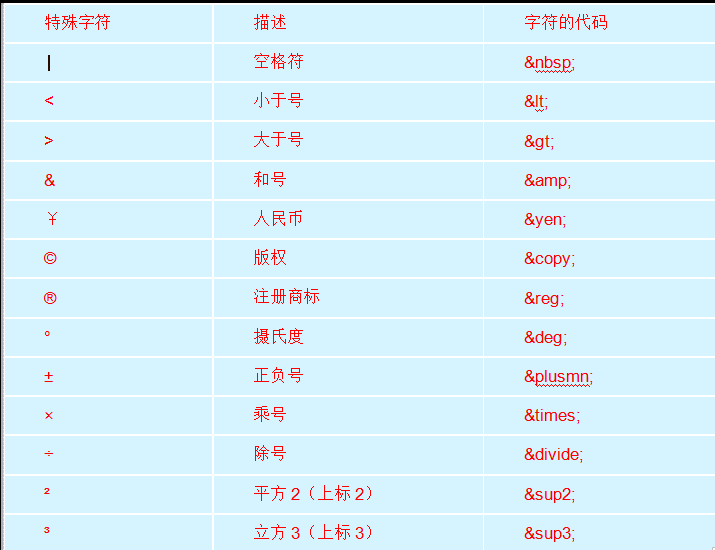
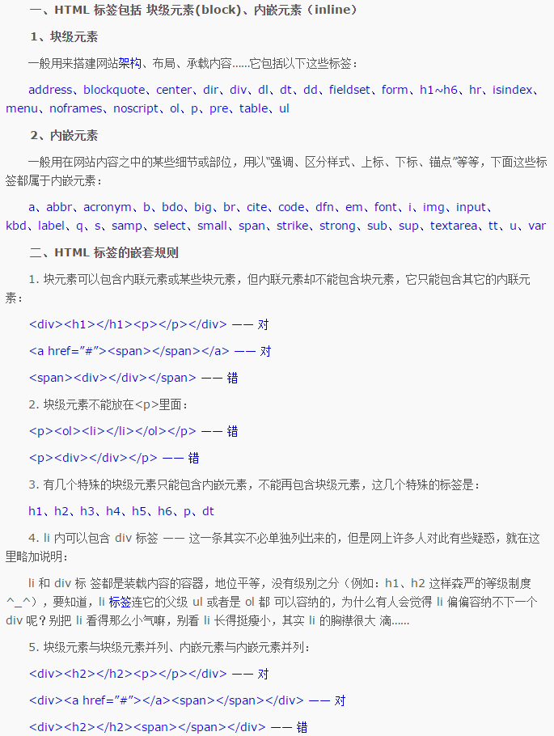

# 总结

## 构建策略

两种网站构建策略

渐进增强progressive enhancement : 先针对低版本浏览器做基本功能，再针对高版本浏览器去美化和增强，此策略一般用于PC端（PC端仍然有很多老版本浏览器）
优雅降级graceful degradation : 先针对高版本浏览器做最完整的功能，再针对低版本的浏览器进行修补，此策略一般用于移动端（移动端浏览器普遍比较新）

渐进增强和优雅降级只是策略不同，最终的结果可能是一样的

## 基础

### 关于浏览器

#### 什么是浏览器
浏览器是指可以显示网页服务器或者文件系统的HTML文件（标准通用标记语言的一个应用）内容，并让用户与这些文件交互的一种软件。

#### 什么是服务器
服务器，也称伺服器，是提供计算服务的设备。由于服务器需要响应服务请求，并进行处理，因此一般来说服务器应具备承担服务并且保障服务的能力。

#### 浏览器内核及使用它的主流浏览器
1. Trident：ie , 猎豹安全浏览器,360极速浏览器,百度浏览器...
2. Gecko：Firefox
3. Webkit：Safari
4. Blink：Chrome，Opera

### SEO

SEO是由英文Search Engine Optimization缩写而来， 中文意译为“搜索引擎优化”。SEO是
指通过站内优化比如网站结构调整.网站内容建设.网站代码优化等以及站外优化，比如网站站外推广.网站品牌建设等，使网站满足搜索引擎收录排名需求，在搜索引擎中提高关键词排名，从而吸引精准用户进入网站，获得免费流量，产生直接销售或品牌推广。

#### 搜索引擎不优化的网站的主要特征

1. 网页中大量采用图片或者Flash等富媒体（Rich Media）形式，没有可以检索的文本信息，而SEO最基本的就是文章SEO和图片SEO；
2. 网页没有标题，或者标题中没有包含有效的关键词；
3. 网页正文中有效关键词比较少（最好自然而重点分布，不需要特别的堆砌关键词）；
4. 网站导航系统让搜索引擎“看不懂”；
5. 大量动态网页影响搜索引擎检索；
6. 没有其他被搜索引擎已经收录的网站提供的链接；
7 网站中充斥大量欺骗搜索引擎的垃圾信息，如“桥页（也叫门页，过渡页）”.颜色与背景色相同的文字；
8. 网站中缺少原创的内容，完全照搬硬抄别人的内容等。

#### 搜索引擎优化方法

##### 内部优化

1. META标签优化：例如：TITLE，KEYWORDS，DESCRIPTION等的优化
2. 内部链接的优化，包括相关性链接（Tag标签），锚文本链接，各导航链接，及图片链接
3. 网站内容更新：每天保持站内的更新(主要是文章的更新等)
4. 代码压缩改进：例如：网站主页唯一性，网站内页链向主页，301,404等改进

##### 外部优化

1. 外部链接类别：博客.论坛.B2B.新闻.分类信息.贴吧.问答.百科.社区.空间.微信.微博等相关信息网等尽量保持链接的多样性。
2. 外链组建：每天添加一定数量的外部链接，使关键词排名稳定提升。
3. 友链互换：与一些和你网站相关性比较高,整体质量比较好的网站交换友情链接,巩固稳定关键词排名。

##### 链接优化

###### 网站结构优化

1. 建立网站地图
只要有可能，最好给网站建一个完整的网站地图sitemap。同时把网站地图的链接放在首页上，使搜索引擎能很方便的发现和抓取所有网页信息。
2. 每个网页最多距离首页四次点击就能到达。
3. 网站的导航系统最好使用文字链接。
4. 网站导航中的链接文字应该准确描述栏目的内容。
5. 整站的PR传递和流动。
6. 网页的互相链接。

###### 搜索引擎如何抓取网页

1. 搜索引擎如何爬取。（按什么规则，怎样爬取）
2. 物理及链接结构
3. URL静态化
4. 绝对路径和相对路径
5. 内链的权重分配及网站地图
6. 避免蜘蛛陷阱

###### 链接结构

网络结构的第二个结构形式：链接结构也称为逻辑结构，也就是有网站内部链接形成的链接的网络图。
比较合理的链接结构通常是树形结构。

###### 关键词选择

1. 使用百度推广助手中关键词工具进行选择适合推广的词；
2. 做调查来选取关键词；
3. 通过查看统计日志来选取关键词；
4. 长尾关键词 ；
5. 将关键词进行多重排列组合；
6. 尽量不要使用行业通用词；
7. 擅于利用地理位置；
8. 确定关键词的价值；
9. 长尾词的选择；
10. 关键词的时效性；
11. 分析竞争对手；
12. 有些词是从百度的相关搜索中过来的，而非用户搜索的关键词。

### 锚点

```
<a href=”页面的路径”></a>
```

a标签的其它名称：超级链接，超链接，锚链接。

作用：可以在一个页面跳转到另一个页面。

注意：在a标签之内必须要写上文字，如果没有，那么这个标签在页面上找不到。

a标签的其它用法：

1. 可以不跳转（跳转到当前页面）href=”#”
2. 可以跳转到另外的页面。
3. 可以在当前页面进行定位。
    + 设置a标签的href属性为“#id名”，
    + 在页面的指定位置加入一个目标标签（可以是任意标签）
    + 必须给这个标签设置一个id名：`<p id=”mubiao”>这是目标</p>`
4. 在跳转的页面进行定位。
5. 可以进行下载。（强烈不推荐使用）

a标签的属性：

- href :   a标签跳转的目标地址
- target =
    + _blank:保留原始页面，再进行跳转
    + _self:在当前页面进行跳转
- base:为页面上所有的a标签设置跳转的方式（base标签一般放在titile标签下面）

### Doctype

&emsp;&emsp;将来在使用DOCTYPE的时候建议使用html5的类型。每个页面都要设置一个doctype，如果不设置，浏览器会默认开启quirks mode（怪异模式）解析

怪异模式:
&emsp;&emsp;（quirks mode）是浏览器为了兼容很早之前针对旧版本浏览器设计、并未严格遵循 W3C 标准的网页而产生的一种页面渲染模式

### meta标签

常用用法：
    1. Description：可以描述页面，可以用来使用百度程序（网络爬虫）来收录关键信息，  以此提高页面的排名。
    2. Keywords：关键词，可以用来提高页。面的关健词的比重（前升排名的一种方式。）
    3. 字符集（编码格式）：
```<meta http-equiv="Content-Type" content="text/html;charset=UTF-8">```

Charset（字符集的格式）：UTF-8/gb2312

注意：字符集（文字在电脑是存储的字典）：

电脑是不能直接存储文字的，一般情况下电脑存储的是这个文字在“字典”里对应的位置。
      - gb2313---->gbk;
      - 国标2313---->国标扩

所以一般看到乱码的原因是因为查找的字典不对

### 编码字符

#### GBK和UTF-8的区别

##### 相同点：都是字符的编码格式。
##### 区别：
    utf-8:收录是全世界所有的语言中的文字。
    gbk:收录了汉字，片假名。
* 大小：
utf-8>gbk
* 性能：
uft-8<gbk
* 字节:
utf-8存储一个汉字占3个字节，
gbk存储一个汉字上2个字节

### 转义字符

Html中空格的合并现象：

特点：无论在页面有同时出现多少个空格，缩进，换行，将来浏览器在解析的时候只会当一个空格显示。

结论：html中对空格，缩进，换行不敏感，如果同时出现多个空格缩进或者执行，页面只会把它们当作一个空格来解析。



### 语义标签

没有语义的标签,一般用于布局,如div , span

**P 标签中不能放 div标签**

### html中标签的嵌套规则：

标签之间是不能够随意嵌套的。
如果一定要嵌套，要满足下面几条：
- 行内元素只能包含行内元素
- 块级元素可以包含所有的行内元素和部分块级元素。
- p标签，h标签都不能包含块级元素



## CSS

### css的初始化：（css reset）

每个浏览器有自己不同解析标签的方式：为了能够让不同的浏览器显示的页面效果是一样的，我们需要清除浏览器的默认样式:
```css
* {margin: 0; padding: 0;}//我们让你成为历史
```

css的初始化：
1. 清除标签的margin和padding:
`html,body,ul,li,ol,dl,dd,dt,p,h1,h2,h3,h4,h5,h6,form,fieldset,legend,img{margin:0;padding:0}`
2. 清除img的边框
`img { border: 0};`
3. 清除li标签之前的小点
`ul{list-style: none;}`
4. 给页面设置一个统一的字体大小和颜色，还要设置body的背景颜色。
`body {font-size: 12px;color: #434343;font-family: "宋体";baccolor: “#ffffff”}`
5. 清除浮动
```css
.clearfix:after {
    content: "";
    height: 0;
    line-height: 0;
    display: block;
    visibility: hidden;
    clear: both;
}
.clearfix {zoom: 1;}
```
6. a标签设置字体颜色，去掉下划线，以及a:hover
```css
a {color: #434343;text-decoration: none;}
a:hover {color: green;}
```
7. 设置浮动：
```css
.fl {float: left;}
.fr {float: right;}
```

### css的三大特效

- 继承

    + 作用：给父元素设置一个属性，然后子元素可以使用
    + 应用：如果页面上有很多的文件都是红色，并且大小都是20px，那么这个时候给每个元素单独设置会很麻烦，所以可以考虑继承。
    + 注意：将来在写代码的时候，我们的css初始化，与页面文字的整体颜色一般会先设置。

*什么样的属性才可以继承呢？*
凡是以line-,text-,font-开头的属性都是可以继承。
- 层叠
    + 是页面处理冲突属性的一个能力。
    + 如果多个选择器为同一个元素设置了不同的属性它们会同时作用于这个元素。
    + 如果多个选择器为同一个元素调协了相同的属性它们会发生层叠。
    + 层叠的最终结果跟优先级有关系。
- 优先级

优先级从大到小:

**！important > Id > 类 > 标签 > 通配符 > 继承 > 浏览器默认**


### font

固定顺序,不可更改

```font:font-style font-weight font-size/line-height font-family;```

其中不需要设置的属性可以省略（取默认值），但必须保留font-size和font-family属性，否则font属性将不起作用

### background

```
background:basckground-color(颜色) background-image(图片) background-repeat(平铺) background-postion(位置);

background:img/1.gif no-repeat(repeat-x,repeat-y) 0 0(left center);
```

### 间距

#### letter-spacing:字间距

letter-spacing属性用于定义字间距，所谓字间距就是字符与字符之间的空白。其属性值可为不同单位的数值，允许使用负值，默认为normal

#### word-spacing:单词间距

word-spacing属性用于定义英文单词之间的间距，对中文字符无效。和letter-spacing一样，其属性值可为不同单位的数值，允许使用负值，默认为normal。

word-spacing和letter-spacing均可对英文进行设置。不同的是letter-spacing定义的为字母之间的间距，而word-spacing定义的为英文单词之间的间距。

#### line-height:行间距

line-height属性用于设置行间距，就是行与行之间的距离，即字符的垂直间距，一般称为行高。行高是可以继承的。

*行高的单位：*
    + *具体的像素值*。
    + *使用em* : em指的是当前标签设置的字体大小。比如当前标签字体大小为16px，那么2em=32px，如果当前标签字体大小为20px，那么3em=60px;
    + *使用%百分号*:与em一样，都是以当前标签的字体大小为基数，如果大小18px，那么 `line-height:200%;line-height: 36px;`
    + *可以什么单位都不带*：数值为倍数,与em一样，也是当前标签的字体大小为基数。

**注意：**

1. 在设置行高的时候，如果单位是em或者%，那么将来行高会先计算出来结果以后再继承给子元素。
2. 在设置行高的时候，如果单位是没有，那么将来行高会先继承给子元素，然后再计算出行高。

```font:font-style font-weight font-size/line-height font-family;```

### text

#### text-decoration:文本装饰

text-decoration属性用于设置文本的下划线，上划线，删除线等装饰效果，其可用属性值如下：
- none：没有装饰（正常文本默认值）。
- underline：下划线。
- overline：上划线。
- line-through：删除线。

另外，text-decoration后可以赋多个值，用于给文本添加多种显示效果，例如希望文字同时有下划线和删除线效果，就可以将underline和line-through同时赋给text-decoration。

#### text-align:水平对齐方式

text-align属性用于设置文本内容的水平对齐，相当于html中的align对齐属性。其可用属性值如下：
- left：左对齐（默认值）
- right：右对齐
- center：居中对齐

#### text-indent:首行缩进

text-indent属性用于设置首行文本的缩进，其属性值可为不同单位的数值、em字符宽度的倍数、或相对于浏览器窗口宽度的百分比%，允许使用负值, 建议使用em作为设置单位。

```
text-indent:2em;
```

### 其他不常用属性

#### white-space:空白符处理

使用HTML制作网页时，不论源代码中有多少空格，在浏览器中只会显示一个字符的空白。在CSS中，使用white-space属性可设置空白符的处理方式，其属性值如下：
- normal：常规（默认值），文本中的空格、空行无效，满行（到达区域边界）后自动换行。
- pre：预格式化，按文档的书写格式保留空格、空行原样显示。
- nowrap：空格空行无效，强制文本不能换行，除非遇到换行标记<br />。内容超出元素的边界也不换行，若超出浏览器页面则会自动增加滚动条。

#### word-break:自动换行

- normal   使用浏览器默认的换行规则。
- break-all   允许在单词内换行。
- keep-all    只能在半角空格或连字符处换行。

#### word-wrap 

属性允许长单词或 URL 地址换行到下一行normal  
- normal  只在允许的断字点换行（浏览器保持默认处理）。
- break-word  在长单词或 URL 地址内部进行换行。
几乎得到了浏览器的支持

### 锚伪类

在使用的时候一定遵守这样的顺序：
a:link ,a:visited,a:hover,a:active  (lv-ha)

lv只能作用在a标签上,ha可作用在其他标签上

- a:link

作用：给a标签设置没有被访问过的样式

```
a: link {
color: red;
font-size: 30px;
}
```
- a:visited

作用：给a标签设置访问过的样式,不能设置字体大小；
```
a:visited {
color: pink;
}
```
- a:hover

作用：给a标签设置鼠标悬停时的样式。
```
a:hover {
color: yellow;
font-size: 50px;
}
```
- a:active

作用：设置a标签被激活时的样式（被点击时的样式）。
```
a:active {
color: green;
font-size: 60px;
}
```

### input:focus

伪类元素获取焦点时。
```
input:focus{
 background-color：pink；
} 
```   

### border

```border: border-width  border-style  border-color;```

`border-collapse: collapse;/*去掉单元格之间的间隙*/`

### padding

- `padding: 40px;`:上右下左 :40px
- `padding: 40px 80px;`:上下40px，左右80px
- `padding: 40px 60px 80px;`:上40px，左右60px，下80px
- `padding: 40px 60px 80px 100px;`:上40px,右60px，下80px，右100px。

**特殊情况下padding不会改变盒子的大小***

当一个大盒子包含一个小盒子，并且大小盒子都是块级元素，而且小盒子的宽是继承自大盒子的话，那么设置小盒子的padding-left不会改变小盒子的大小。

### margin

- `margin: 10px;` 上右下左10px。
- `margin: 10px 20px;` 上下10px，左右20px
- `margin: 10 px 20px 40px;`  上10px，左右20px，下40px
- `margin:10px 20px 40px 80px;` 上10，右20，下40，左80

#### 注意点
很多标签默认带有margin和padding，所以将来进行页面的布局的时候一定要清除这些标签的默认的margin和padding.
例如：
1. body标签默认带有margin: 8px的属性
2. p标签默认带有margin: font-size 0;
3. h标签也默认带有margin-top和margin-bottom
4. ul默认带有上下的margin以及左边的padding
......

清除的方法：
```
* {
    margin: 0;
    padding: 0;
}
```

#### margin两种特殊的现象：

1. 外边距的合并现象：

如果两个div上下排序，给上面一个div设置margin-bottom，给下面一个div设置margin-top，那么两个margin会发生合并现象，合并以后的值较大的那个。
2. margin塌陷现象：

如果一个大盒子中包含一个小盒子给小盒子设置margin-top大盒子会一起向下平移。

*解决方案：*
    - 给大盒子加一个边框
    - 给大盒子设置一个overflow属性。
    - 浮动也可以

### 清除浮动

- 使用额外标签法：  

在浮动的盒子之下再放一个标签，在这个标签中使用clear:both，来清除浮动对页面的影响。
    + a.内部标签：会将这个浮动盒子的父盒子高度重新撑开
    + b.外部标签：会将这个浮动盒子的影响清除，但是不会撑开父盒子。

注意：一般情况下不会使用这一种方式来清除浮动。因为这种清除浮动的方式会增加页面的标签。
- 使用overflow属性来清除浮动：

先找到浮动盒子的父元素，再在父元素中添加一个属性：overflow:hidden,就是清除这个父元素中的子元素浮动对页面的影响。

注意：一般情况下也不会使用这种方式，因为overflow:hidden有一个特点，溢出这个元素所在的区域以后会被隐藏（等我们学完overflow以后大家就明白了）。
- 使用伪元素来清除浮动：
```
.clearfix:after {
    content: "";//添加内容为空
    height: 0;//内容高度为0
    line-height: 0;//内容文本的高度为0
    display: block;//将文本设置为块级元素
    clear: both;//清除浮动
    visibility: hidden;//将元素隐藏
}
.clearfix {
    zoom: 1;/*为了兼容ie6*/
}
```
- 伪元素：

伪元素：在页面上不存在的元素，但是可以通过css来添加上去。

种类：
    :after（在...之后）
    :before（在...之前）

注意：每个元素都有自己的伪元素。


### position(定位)

#### static:静态的

`position:static;` :静态定位

所有的标准流中的元素都是静态定位。

#### relative:相对的

`position：relative;`：相对定位。

使用的时候还要配合：(trbl)top,left,right,bottom来使用。

*特点*：如果设置了相对定位并且设置了trbl属性，那么将来盒子会以盒子原本的位置发生偏移。

    - 相对于原来的位置进行平移。
    - 设置了相对定位的元素在页面上占据了位置（没有脱离标准流）。

总结：想当年。

#### absolute:绝对的

`position:absolute;`: 绝对定位

使用的时候也要配合trbl属性来使用

*特点*：
- 如果这个元素没有父元素，那么将来trbl是相对于body来定位的
- 如果绝对定位的元素有父元素，但是父元素没有定位，那么这个时候trbl还是相对于body来定位的。
- 如果绝对定位的元素有父元素，而且父元素有定位（非static），那么这个绝对定位的元素偏移是以自己的父元素为基础。
- 绝对定位之后的元素在页面不会占据位置（绝对定位以后的元素会脱离标准流）。

总结：看脸型。

将来在写页面的时候用的最多的既不是绝对定位也不是相对定位，而是绝对定位与相对定位一起使用：

（规范）**子绝父相**。 =>  子元素使用绝对定位，父元素使用相对定位。

案例：
如果小盒子在大盒子中要定位并且水平居中：
先left: 50%，将小盒子在大盒子平移大盒子的一半，再设置margin-left：-(小盒子宽度的一半),注意一定是负数，那么将来小盒子在大盒子中就可以水平居中了。

#### fixed：固定

`position:fixed;`: 固定定位

使用的时候也要配合trbl属性来使用

*特点*：
- 不管页面有多大，trbl永远是相对于浏览器的边框来的。
- 固定定位的元素也脱离了标准流（不在页面上占据位置）

总结：死心眼型。

#### z-index (层级)

作用：设置页面中元素的层级关系。

取值：正整数。(值越大层级越高)

### 其他补充

#### 图片与文本对齐方式

如果文本与图片在同一行中，那么将来文字与图片的默认对齐方式是文字的基线对齐图片的底线。

`vertical-align`：设置文本与图片的对齐方式：

取值： `middle`:将中线对齐


#### overflow:溢出

- hidden：会将超出容器的部分隐藏起来
- scroll：给容器加上滚动条
- auto：根据具体情况判断容器是否要加上滚动条

#### 元素的隐藏：

- `overflow:hidden;`:将超出的部分裁剪掉
- `visibility:hidden;`:可以将元素隐藏，但是在页面上还保留着原来的位置（停薪留职）
- `display:none;`:可以将元素隐藏，并且在页面不占据位置。

**diplay:none与display:block是一对反义词。**

### 透明度：

opacity:不透明度
赋值：opacity:0.5;
取值：在0-1之间的小数。

### 圣杯布局

特点：左右两边的内容保持不变，中间的内容可以根据屏幕的大小的改变而改变。
又名：双飞翼布局。

```
<style>
    .content {
         padding: 0 200px;
         height: 200px;
             min-width: 200px;
    }
    .left {
       13  width: 200px;
        height: 200px;
        background: red;
        float: left;
        margin-left: -200px;
    }
    .right { 
        width: 200px;
        height: 200px;
        background: yellow;
        float: right;
        margin-right: -200px;
    }
    .center {
        width: 100%;
        min-width: 200px;
        height: 200px;
        background: green;
        float: left;
    }
</style>
<body>
    <div class="content">
        <div class="left"></div>
        <div class="center"></div>
        <div class="right"></div>
    </div>
</body>
```

### 滑动门

#### 简单滑动门 (将一张图片分为左中右三张图片)

```
<ul><li>图片左部分<a href="#">图片中部分</a><span>图片右部分</span></li></ul>
```

#### 中级滑动门 (将一张图片分为左右两张图片)

```
<style>
    li {
        float:left;
        list-style: none;
        padding-left: 6px;
        background: url(img/02_left.png) no-repeat;
    }
    a {
        display: inline-block;
        height: 35px;
        line-height: 35px;
        background: url(img/02_right.png) no-repeat right top;
        padding-right: 25px;
    }
</style>
<body>
   <ul><li><a href="#">导航</a></li></ul> 
</body>
```
#### 高级滑动门 (使用两张一样的图片)

```
<style>
    li {
        list-style: none;
        float: left;
        padding-left: 6px;
        background: url(img/bb.png) no-repeat;
        height: 35px;
    }
    a {
        display: inline-block;
        padding-right: 25px;
        height: 35px;
        line-height: 35px;
        background: url(img/bb.png) no-repeat right top;
    }
</style>
<body>
    <ul><li><a href="#">导航</a></li></ul>
</body>
```

### 三角形

#### 易迅三角 ▼ 

```
<style>
    div{
        position: relative;
    }
    span {
        position: absolute;
        top: 5px;
        display: inline-block;
        width: 0;
        height: 0;
        border-width: 10px;
        border-color: red transparent transparent transparent ;
        border-style: solid dashed dashed dashed;
    }
</style>
<body>
    <div>这是一段文本<span></span></div>
</body>
```

#### 淘宝三角 

```
<style>
    b {
        position: absolute;
        display: inline-block;
        width: 0;
        height: 0;
    }
    .one {
        bottom: 0;
        right: 0;
        border-width: 30px;
        border-color: transparent transparent transparent red ;
        border-style: dashed dashed dashed solid;
    }
    .two {
        bottom: 0;
        right: 20px;
        border-width: 30px;
        border-color: transparent transparent transparent white ;
        border-style: dashed dashed dashed solid;
    }
</style>
<body>
    <div>
        <b class="one"></b>
        <b class="two"></b>
    </div>
</body>
```

## JS基础

web前端三层来说：w3c的规范：行内样式（淘汰）
结构层 HTML        从语义的角度，描述页面结构
样式层 CSS     从审美的角度，美化页面
行为层 JavaScript  从交互的角度，提升用户体验


