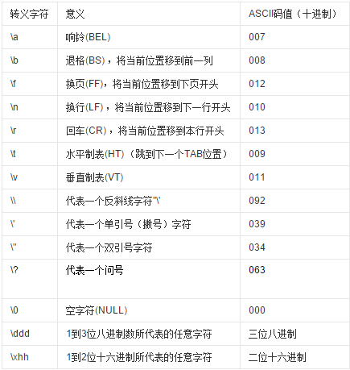

# js基础-ECMAscript

## 代码注释
```js
- // 注释         =>  单行注释
- /* 注释 */      =>  多行注释
- /** + 回车键    =>  函数注释
```

## 变量

### 变量的命名

#### 变量的命名规则

1. 由字母、数字、下划线、$ 组成且开头不能是数字
2. 不能是关键字和保留字
3. 区分大小写

#### 变量的命名规范(建议遵守)

1. 变量的名称要有实际意义
2. 规则中所说的字母包括ASCII和Unicode字母字符，如汉字，但不推荐使用
3. 变量的命名遵守驼峰命名法，首字母小写,第二个单词的首字母大写
例如：userName

### 变量的声明和使用

- 变量是在计算机中存储数据的一个标识符。 
- 变量可以在声明的时候赋值，也可以稍后赋值。

例如：
```js
var number = 50;
var name = "马户";
```
或者
```js
var name; 
name = “张三”;
//可以在一行上定义多个变量
var name,age,sex;
```

### 如何交换两个变量的值
- 使用第三方变量

```js
var a = 10;
var b = 20;
var tmp = a;
a = b;
b = tmp;
console.log(a); //20
console.log(b); //10

```

- 不使用第三方变量(仅限于变量值是数值类型)

```js
var a = 10;
var b = 20;
a = a + b;
b = a - b;
a = a - b;
console.log(a,b);//20,10

```

## 数据类型

### 基本数据类型(值类型)

#### number

```js
//十进制 0123456789 用十个符号表示所有数值
var a = 123;//字面量 直接量

//八进制 用八个符号表示所有的数值 01234567
var b = 010;//八进制的字面量
console.log(b);//在控制台打印输出的时候 是会转换成十进制的

//十六进制 0123456789abcdef 用十六个符号表示所有的数值
var c = 0x10;
console.log(c);//会转换成十进制的值

//浮点数
var n = 5e+4;//xe+y 表示 x乘以 10的y次方 5*10000
var n = 5e-4;//xe+y 表示 x乘以 10的y次方 0.0005
console.log(n);
//浮点数会丢失精度
var num1 = 0.1;
var num2 = 0.2;
console.log(num1 + num2);//0.3
console.log(0.07 * 100);//

```

\** 注意:

    1. NaN 是数值类型
    2. NaN 不等于自身
    3. isNaN : is Not is a Number => 是不是一个(有意义)数字
     3.1. 若为true,则表示不是一个数字
     3.2. 若为false,则表示是一个数字
     3.3. 用法 : isNaN(变量)
    4. 最大值 : Number.MAX_VALUE
    5. 最小值 : Number.MIN_VALUE
    6. 无穷 : Infinity

**数值转换**

    - Number(值) : 强制转换,将任意类型转化为数值型
        `Number(12.8px) : NaN`
        a)如果转换的内容本身就是一个数值类型的字符串，那么将来在转换的时候会返回自己。
        b)如果转换的内容本身不是一个数值类型的字符串，那么在转换的时候结果是NaN.
        c)如果要转换的内容是空的字符串，那以转换的结果是0
        d）如果是其它的字符，那么将来在转换的时候结果是NaN
    - parseInt('字符串') : 将字符串转化为数值,小数点后数字省略
        a)忽略字符串前面的空格，直至找到第一个非空字符,还会将数字后面的非数字的字符串去掉。
        b)如果第一个字符不是数字符号或者负号，返回NaN
        c）会将小数取整。（向下取整）Math.floor
    - parseFloat('字符串') : 将字符串转化为数值,可保留小数点
    - 除了+ 号以外的运算符号(+号是连接运算符)

**NaN**

有一种特殊的数据:NaN(not a number)

NaN 是计算发生错误时的一种状态， 也是number类型的数据。
判断是否是NaN的一个关键字:isNaN(is not a number):是非数字
如果结果是NaN,，那么isNaN的结果是true,如果是一个正常的数字，isNaN返回的值是false;如果结果是一个字符串，那么isNaN的结果是true,

#### string

```js
var str = 'abdeidj';
console.log(str.length);//7  str.length 计算字符串长度

```

\** 注意:

    + 转义符
        * \n : 换行
        * \' : 单引号
        * \" : 双引号
        * \\ : 斜杠
    + 字符串的不可变性,大量拼接字符串会非常消耗资源

** *字符串的转换* **

    - String(值) : 任意类型转化为字符串
    - 值.toString() : 大部分类型都有此方法
    - 值 + " " : 隐式转换

**字符串的操作方法**

字符串所有的方法，都不会修改字符串本身(字符串是不可变的)，操作完成会返回一个新的字符串

1. *字符方法*
    + charAt()    //获取指定位置处字符
    + charCodeAt()  //获取指定位置处字符的ASCII码
    + str[0]   //ES5，IE8+支持 和charAt()等效

2. *操作方法*
    + concat()   //拼接字符串，和+一样
    + slice()     //从start位置开始，截取到end位置，end取不到
    + substring() //从start位置开始，截取到end位置，end取不到
    + substr()    //从start位置开始，截取length个字符

3. *位置方法*
    + indexOf()   : 可返回某个指定的字符串值在字符串中首次出现的位置
        `string.indexOf(searchValue,formindex)`
            * searchvalue:必需。规定需检索的字符串值。
            * fromindex:可选的整数参数。规定在字符串中开始检索的位置。它的合法取值是 0 到 string.length - 1。如省略该参数，则将从字符串的首字符开始检索。
    + lastIndexOf() //从后往前找，只找第一个匹配的

4. *大小写转换方法*
    + to(Locale)UpperCase() //转换大写
    + to(Locale)LowerCase() //转换小写

5. *其他方法*
    + trim()  //只能去除字符串前后的空白
    + split()  //把字符串切割成字符数组

6. 匹配方法
    - search()
    - replace():用于在字符串中用一些字符替换另一些字符,或替换一个与正则表达式匹配的子串.
    `stringObject.replace(regexp/substr,replacement)`
        + regexp/substr : 必需,规定字符串或要替换的模式RegExp对象.请注意,如果该值是一个字符串,则将它作为要检索的直接量文本模式,而不是首先被转换为RexExp对象.
        + replacement : 必需,一个字符串.规定了替换文本或生成替换文本的函数

7. localeCompare()//两个字符串比较的是ASCII码
    - s1.localeCompare(s2)   
        + s1 > s2 返回正数，一般是1
        + s1 == s2 返回0
        + s1 < s2  返回负数，一般是-1

8. fromCharCode()
    - String.fromCharCode(101,102,103); //把ASCII码转换成字符串


#### boolean

\** 注意:

    + 值
        * true
        * false
        * 只能为小写
    + 会转化成false的值有 : 空字符串"" 数值零0 NaN undefined null

** *布尔值的转换* **

    - Boolean(值) : 将任意类型转化为布尔值
    - if(值) : 条件判断中会自动转换
    - !!值 : 隐式转换

#### undefined

有声明,无赋值,则为undefined

undefined派生自null

#### null

空

### 复杂数据类型(引用类型)

**Number**

**String**

**Boolean**

**Object**

**Function**

**Array**

### 查看变量的数据类型
typeof 是一个关键字,它返回的数据类型是字符串
```
typeof 变量 // 获得变量的数据类型
typeof(变量) 

``` 

## 操作符

### 一元运算符

- 递增 ++
- 递减 --
- a++ : 先参与运算,后自加
- ++a : 先自加 后参与运算

### 算术运算符
\+ &emsp; \- &emsp; \* &emsp; / &emsp; %

### 逻辑运算符

- &&(短路)
与 : false && 不管了  (一false都false)
- ||(短路)
或 : true || 不管了 (一true都true)
- !
非

### 赋值运算符

+= &emsp; -= &emsp; *=  &emsp; /=  &emsp; %=

```js
a += b
//等价于
a = a + b
```

### 运算符优先级

- 优先级最高:  ( )
- 一元运算符:  ++ &emsp; -- &emsp; !
- 算数运算符:  先 * &emsp; / &emsp; % ; 后 + &emsp; - 
- 关系运算符:  > &emsp; >= &emsp; < &emsp; <=
- 相等运算符:  == &emsp; != &emsp; === &emsp; !==
- 逻辑运算符:  先&& 后||

## Javascript内置对象

### Math


### Date()

- **获取当前时间**<br>
    + ` var date = new Date();` : 返回字符串<br>
    + 可以通过以下方式返回数值类型的时间的毫秒形式，以便运算<br>
        * `var date = Date.now(); ` : //ES5，IE9+ <br>
        * `var date = +new Date();` ://不支持now方法的时候<br>
        * `var date = new Date(2005,10,1);` 
             + 可以接受三种参数
                 * 2005，10，1日期的每一部分
                 * "2005-10-1"  字符串的日期格式
                 * 表示日期的毫秒形式1128096000000 <br>
        * `var date = Date.parse("2005-10-1");`<br>
        把字符串或2005，10，1日期的每一部分转换成日期的毫秒形式，如果字符串的格式不是时间的正确格式返回NaN
- **日期格式转化方式**
    + toString()
    + valueOf()   -- 返回时间对象对应的毫秒数字，因此可以直接判断两个时期的大小
    + toDateString()
    + toTimeString()
    + toLocaleDateString()
    + toLocaleTimeString()
    + 不同的浏览器，各种to...String()返回的结果不一致
- **获取日期中指定部分**
    + getTime()  返回毫秒数和valueOf()结果一样
    + getMilliseconds() 
    + getSeconds()  返回0-59
    + getMinutes()  返回0-59
    + getHours()   返回0-23
    + getDay()     返回星期几 0周日   6周6
    + getDate()    返回当前月的第几天
    + getMonth()   返回月份，从0开始0-11
    + getFullYear()   返回4位的年份  如 2016

## 语句

### 选择语句 

#### if-else
```js
    if (condition) {
        statement1
    } else if (condition) {
        statement2
    } else {
        statement3
    }
```

例子:
```js
    var age = 20;
    if (age >= 18) {
        console.log("欢迎");
    } else if (age >= 16) {
        console.log("借你个18岁的身份证");
    } else if (age >= 10) {
        console.log("太小了");
    } else {
        console.log("回去写作业");
    }
```

#### switch
```js
    switch (expression) {
        case value:
            statement
            break;
        case value:
            statement
            break;
        default:
            statement
    }
```

例子:
```js
    var a = "a";
    switch (a) {
        case "a":
            console.log("a");
        case "b":
            console.log("b");
        default :
            console.log("default");
    }
```

#### 三元表达式
```js
表达式1 ? 表达式2 : 表达式3
//表达式1位true执行表达式2,为false执行表达式3
```

### 循环语句

#### for
```js
for (initialization; expression; post-loop-expression)｛
    statement 
｝
//initialization:初始化表达式
//expression:控制表达式
//post-loop-expression:循环后表达式
```

例子:
```js
    var i = 1;
    for (; i <= 5;) {
        console.log(i);
        i++;
    }
    //或者
    for (var i = 1; i <= 5;i++) {
        console.log(i);
    }
```

#### while

先判断后执行
```js
while(expression) statement
```

例子:
```js
    while (i <= 100){
     sum += i;
     i++;
     } 
```

#### do-while

先执行后判断
```js
do {statement} while (expression);
```

例子:
```js
    do {
     sum += i;
     i++;
     } while (i <= 100);
```

#### *break和continue*
- break 跳出当前循环,执行循环后的语句
- continue 跳出当前循环,继续执行循环

## 数组

### 数组的声明

- 通过构造函数声明(更加通用)
```js
var arr = new Array("a", "b", "c");
```

- 通过字面量声明(更加便捷)
```js
var arr = ["a","b","c"];
```

### 数组的赋值和取值

- 赋值

```js
数组名[索引号] = 值 //arr[0]=100
```

- 取值

```js
数组名[索引号]  //console.log(arr[0])
```

### 数组的遍历

```js
for (var i = 0; i < arr.length; i++) {
    console.log(arr[i]);
}
```

### 数组的方法


**补充**
- 位置方法
   + indexOf()  :寻找指定项目在数组中的位置
   + lastIndexOf()   :如果没找到返回-1 
- 迭代方法 （ES5中的新方法，不会修改原数组）
   + every()、filter()、forEach()、map()、some()

### 数组的应用

- 冒泡排序
```js
for(var i = 0; i < arr.length-1; i++){
    var flag = true;
    for(var j = 0; j < arr.length - i - 1; j++){
        if(arr[j] > arr[j+1]){
            var tmp = arr[j];
            arr[j] = arr[j+1];
            arr[j+1] = tmp;
            flag = false;
        }
    }
    if(flag){
        break;
    }
}
```

### arr.sort() 

数组排序

arr.sort(compareFunction)
    - compareFunction:可选。用来指定按某种顺序进行排列的函数。如果省略，元素按照转换为的字符串的诸个字符的Unicode位点进行排序。

- 传参
    + 如果 compareFunction(a, b) 小于 0 ，那么 a 会被排列到 b 之前(数值数组从小到大排列)
    + 如果 compareFunction(a, b) 等于 0 ， a 和 b 的相对位置不变(数值数组位置不变)
    + 如果 compareFunction(a, b) 大于 0 ， b 会被排列到 a 之前(数值数组从大到小排列)

希望比较数字而非字符串,比较函数可以简单的以a减b,如下的函数将会将数组升序排列
```js
function compareNumbers(a, b){
    return a - b;
}
```

例子:
```js
var arr = [4, 2, 5, 1, 3];
arr.sort(function(a, b) {
  return a - b;
});
console.log(arr);  // [1, 2, 3, 4, 5]
```

## 函数

### 函数的声明和调用
函数的声明
```js
function 函数名 () {
    //函数体 
}
```

函数表达式
```js
var fn2 = function () {
    //函数体
};
```

函数的调用
```js
函数名();
```

### 函数的参数

- 形参:声明中的参数只是一个占位符,没有实际的值,是形式参数
```js
function 函数名 (参数1,参数2,参数3...) {
    //函数体 
}
```

- 实参:调用时传入的参数才是有真正数值的参数,是实际参数,即实参
```js
函数名(参数1,参数2,参数3...);
```

**在JS中实参的个数和形参的个数可以不一致**

### 函数的返回值

在函数中通过return关键字将要返回值返回

```js
return 要返回的值;
```

函数的返回值是什么，调用这个函数就相当于调用什么，如果没有返回值则为undefined

函数在执行完成return语句后便会退出函数，后面的代码不会执行

### 特殊常用函数

#### 匿名函数

匿名函数:没有名字的函数
```js
function () {
    //函数体
}
```

作用:一般用在绑定事件的时候

*立即执行函数:*
```js
(function(){
    
})()
```

#### 递归调用

程序调用自身的编程技巧称为递归
```js
// 斐波那契数列 1,1,2,3,5,8,13,21,34,55,89...
function f1(n){
    if( n ==1 || n == 2 ){
        return 1;
    }
    f1(n) = f1(n-1) + f1(n-2)
}
```
#### 回调函数

函数也是一种普通的数据类型,因此函数也可以被当作参数传递,被当作参数传递的函数叫做回调函数.

## 对象

从宏观的角度讲，对象是对客观事物的抽象，事物的特征可以用属性表示，事物的行为可以用方法表示<br>
从微观的角度讲，对象就是一种数据类型，通过对象可以方便地对变量和函数进行管理<br>
初期我们甚至可以把他简单地理解为一个工具箱

对象就是键值对的集合  key:value

**对象字面量**
```js
var obj = {
    name : "zs",
    age : 18,
    sayHi : function() {
        console.log(this.name);
    }
};
```

### 对象的声明

通过构造函数声明（更加通用）
```var obj= new Object();```

通过字面量声明（更加简便）
```var obj= {};```

### 对象具有属性和方法

#### 属性

属性: 用来描述对象的特征 一般是名词 对应变量

属性的定义
```js 对象.属性名 = 值 ```

属性的调用
```js 对象.属性名```

#### 方法

方法 用来描述对象的行为 一般是动词 对应函数

方法的定义
```对象.方法名 = function(){ //函数体 };```

方法的调用
```对象.方法名()```

#### 访问属性的两种方式

点语法（简单）
```js 对象.属性名```
中括号（灵活）
```js 对象[“属性名”]```

#### 遍历的两种方式

通过**for-in**可以对集合进行有序的遍历
```js
for(var k in obj) { 语句 }
//k变量代表的是json中的各个属性（key）和 var i = 0中的i是一个意思 名字不同而已
```

## 正则表达式

### 正则的声明和使用

- 通过构造函数定义 `var 变量名= new RegExp(/表达式/)`;
- 通过直接量定义（简单方便，我们一般用这个）`var 变量名= /表达式/`;

常用方法，可用于检测传入的字符串是否符合该规则并返回布尔值
`exp.test("要检测的字符串")`

**| 表示或 或的优先级最低 可以通过()提升优先级**

### 预定义类和转义符

 - `.  [^\n\r]      ` : 除了换行和回车之外的任意字符
 - `\d [0-9]        ` : 数字字符digit
 - `\D [^0-9]       ` : 非数字字符
 - `\w [a-zA-Z0-9_] ` : 单词字符(所有的英文字母数字和_) word
 - `\W [^a-zA-Z0-9_]` : 非单词字符
 - `\s [\f\r\n\t\v] ` : 不可见字符 space
 - `\S [^\f\r\n\t\v]` : 可见字符

### 转义符

- `\f` 表示换页 `form feed`
- `\t` 表示水平制表符 `table`
- `\v` 表示垂直制表符 `vertical table`



### 字符类

- 简单类[abc] 表示该位置可以出现的字符
- 负向类[^abc] 表示该位置不可以出现的字符
- 范围类[a-e]  表示该位置可以出现的字符的范围
- 组合类[a-xA-E0-9] 范围类的组合

### 边界 量词 括号

#### 边界

- `^    ` : 会匹配行或者字符串的起始位置
- `^(非) ` :只有在[]内才表示非 在外边表示开始
- `$    ` : 会匹配行或字符串的结尾位置
- `^$   ` : 在一起 表示必须是这个（精确匹配）

#### 量词

- ` "*" ` :  重复零次或更多 x>=0
- ` "+" ` :  重复一次或更多次 x>=1
- ` "?" ` :  重复零次或一次  x=(0||1)
- `{n}  ` :  n次  x=n
- `{n,} ` :  重复n次或更多  x>=n
- `{n,m}` :  重复出现的次数比n多但比m少 n<=x<=m

#### 括号总结

- `()` : 表示一组
- `[]` : 表示一个字符的位置
- `{}` : 表示次数

#### 常见项目的匹配

- 国内电话号码: `/^0\d{2,3}-\d{7,8}$/`
- 姓名: `/^[\u4e00-\u9fa5]{2,}$/`
- QQ号: `/^[1-9]\d{4,10}$/`
- 手机号: `/^(13[0-9]|14[57]|15[0-9]|18[0-9])\d{8}$/`
- 邮箱: `/^\w+([+-.]\w+)*@\w+([-.]\w+)*\.\w+([-.]\w+)*$/`

#### 封装自己的trim()方法

```js
function trim(str) {
    return str.replace(/^\s+/,"").replace(/\s+$/,"");
}

function trim(str) {
    return str.replace(/^\s+|\s+$/g,"");
}
```


