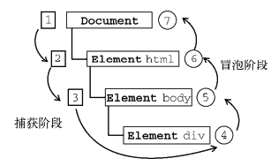

# DOM

DOM: (Document Object Model) 文档对象模型

## 基本概念

### 内容概念

文档(Document): 就是指HTML或者XML文件 <br>
节点(Node):HTML文档中的所有内容都可以称之为节点,常见的节点有:元素节点、属性节点、文本节点、注释节点 <br>
元素(Element):HTML文档中的标签可以称为元素

### 设置属性 

元素对象.属性名 = "属性值" : `img.src= "img/1.png";`

### 事件

事件源.事件 = function(){ 事件处理程序 } : `dom.click = function(){ }`

#### 常用事件

- 鼠标事件mouse:
    + onclick : 点击
    + ondblclick : 双击
    + onmouseover: 鼠标移过
    + onmouseout: 鼠标移出
    + onmousemove: 鼠标移动
    + onmousedown: 鼠标按下
    + onscroll: 鼠标滚动
-表单事件form:
    + onblur: 失去焦点(input):光标不在input上
    + oninput: 用户输入的时候触发
    + onfocus :获取焦点(input):光标在input上
    + onchange: 失去焦点后,表单内容改变的时候触发
    + oninvalid: input元素内的值为无效值时触发的事件,表单验证触发失败
- 键盘事件keyboard:
    + onkeyup : 键盘弹起事件(输出的是键盘码) (event.keyCode获取键盘码)
    + onkeydown: 键盘按下时(输出的是键盘码)
    + onkeypress : 键盘按下,弹起(输出的是ASCII码表)
- 窗体事件window
    + onload : 加载完成事件 `window.onload`(一个页面只能用一个)
    + onresize: on re size 大小发生改变的事件

#### 注册事件的方式

`element.addEventListener(“事件类型”,”事件处理函数”,”是否使用捕获”)`
`element.onclick(“事件类型”,”事件处理函数”)`
`element.attachEvent(“事件类型”,”事件处理函数”)`

addEventListener的好处是不会将其他事件覆盖，但是有兼容性问题;便于管理事件队列 但一般用on的就可以了比较简单

移除事件
- `element.removeEventListener(eventName, listener, false)`可以移除指定事件
- `element.onclick = null` 
- `element.detachEvent("on" + eventName, listener)`


#### 阻止默认事件

- `return false;` : 阻止默认行为,阻止冒泡
- `event.preventDefault()` :阻止默认行为

#### 阻止事件冒泡

- 通用: `return false;`
- w3c的方法是`event.stopPropagation()`
- IE则是使用`event.cancelBubble = true`

```js
if(event.stopPropagation){
        event.stopPropagation();
} else {
        event.cancelBubble = true;
}
```

#### 事件目标

- 火狐谷歌等  : event.target
- IE678       : event.srcElement
- 
```js
var targetId =  event.target ?  event.target.id : event.srcElement.id;
```


#### 事件的三个阶段

1. 捕获阶段
2. 目标阶段   执行当前对象的事件处理程序
3. 冒泡阶段




## DOM节点操作

### 属性

1. Attributes:  存储节点的属性列表(只读)
1. childNodes: 存储节点的子节点列表(只读)
2. dataType: 返回此节点的数据类型
3. Definition: 以DTD或XML模式给出的节点的定义(只读)
4. Doctype: 指定文档类型节点(只读)
5. DocumentElement: 返回文档的根元素(可读写)
6. firstChild: 返回当前节点的第一个子节点(只读)
7. Implementation: 返回XMLDOMImplementation 对象
8. lastChild: 返回当前节点最后一个子节点(只读)
9. nextSibling: 返回当前节点的下一个兄弟节点(只读)
10. nodeName: 返回节点的名字(只读)
11. nodeType: 返回节点的类型(只读)
12. nodeTypeValue: 存储节点值(可读写)
13. nodeValue: 返回节点的文本(可读写)
14. ownerDocument: 返回包含此节点的根文档(只读)
15. parentNode: 返回父节点(只读)
16. Parsed: 返回此节点及其子节点是否已经被解析(只读)
17. Prefix: 返回名称空间前缀(只读)
18. preserveWhiteSpace: 指定是否保留空白(可读写)
19. previousSibling: 返回此节点的前一个兄弟节点(只读)
20. Text: 返回此节点及其后代的文本内容(可读写)
21. url: 返回最近载入的XML文档URL(只读)
22. Xml: 返回节点及其后代XML表示(只读)
23. innerHTML : 获取和设置标签中的内容,设置的内容会当作节点对象被解析到DOM书上
24. innerText : 获取和设置标签中的内容,设置的内容会被当作普通文本(有兼容性问题,旧版ff不支持)
25. textContent : 获取和设置标签中的内容,设置的内容会被当作普通文本(有兼容问题,旧版IE不支持)

### 方法

1. appendChild 为当前节点添加一个新的子节点,放在最后的子节点后
2. cloneNode 返回当前节点的拷贝
3. createAttribute 创建新的属性
4. createCDATASetion 创建包括给定数据的CDATA段
5. createCommment创建一个注释节点
6. createDocumentFragment 创建DocumentFragement对象
7. createElement 创建一个元素节点
8. createEntityReference 创建EntityReference对象
9. createNode 创建给定类型,名字和命名空间的节点
10. createPorcessingInstruction 创建操作指令节点
11. createTextNode 创建包括给定数据的文本节点
12. getElementsByTagName 返回指定名字的元素集合
13. hasChildNodes 返回当前节点是否有子节点
14. insertBefore 在指定节点前插入子节点
15. Load 导入指定位置的XML文档
16. loadXML 导入指定字符串的ML文档
17. removeChild 从子节点列表中删除指定的子节点
18. replaceChild 从子节点列表中替换指定的子节点
19. Save 把CMl文件存到指定点
20. selectNodes 对节点进行指定的匹配,并返回匹配节点列表
21. selectSingleNode 对节点进行指定的匹配,并返回第一个匹配节点
22. transformNode 使用指定的样式表对节点及其后代进行转换
23. transformNodeToObject 使用指定的样式表将节点及其后代转换为对象

### 常见node类型

`节点.nodeType`

nodeType:
    - 1:Element 元素标签
    - 2:Attribute 属性节点
    - 3:text 文本节点
    - 8:comment 注释节点
    - 9:document 文档
    - 11:document_fragment 轻量级的文档

### 节点创建

1. `createElement`: `document.createElement("div")`通过传入指定的一个标签名来创建一个元素
2. `createTextNode`: 创建一个文本节点
3. `cloneNode`: 克隆  parent.cloneNode(true) 克隆parent,并复制其后代元素(深克隆),若为false则表示不复制后代元素(浅克隆)
4. `createDocumentFragment`:  创建一个DocumentFragment

### 页面修改

1. `appendChild` 将指定的节点添加到调用该方法的节点的子元素的末尾
2. `insertBefore` 添加一个节点到一个参照节点之前
    `parentNode.insertBefore(newNode,sonNode)`
        + parentNode表示新节点被添加后的父节点
        + newNode 表示要添加的节点
        + sonNode表示参照节点,新节点会添加到这个节点之前
3. `removeChild` 删除指定的子节点并返回
    `father.removeChild(son)`
4. `replaceChild` 使用一个节点替换另一个节点
    `parent.replaceNode(newChild,oldChild)`
        + newChild是替换的节点,可以是新的节点,也可以是页面上的节点,如果是页面上的节点,则其将被转移到新的位置
        + oldChild 是被替换的节点

### 节点查询:获取元素

1. &.getElementById(ID):  通过id获取元素
2. &.getElementsByTagName(TagName) : 通过标签名获取元素(伪数组)
3. &.getElementsByName(name):通过name获取元素,一般为input
4. &.getElementsByClassName(className):通过类名获取元素(伪数组)
5. &.querySelector(选择器) : 是单一,兼容问题
6. &.querySelectorAll(选择器):伪数组,兼容问题

### 节点关系型

#### 父关系型

    `parentNode` : 父节点(一定是元素节点)

#### 兄弟关系型

- 属性:
    + `previousSibling` 返回前一个节点
    + `previousElementSibling`  返回前一个元素节点,有兼容性问题
    + `nextSibling` 节点的后一个节点
    + `nextElementSibling` 返回后一个元素节点,有兼容性问题

#### 子关系型

- 属性
    + `childNodes` 返回所有的子节点
    + `children` 返回元素节点
    + `firstChild` 第一个节点
    + `firstElementChild` : 第一个子元素,有兼容性问题
    + `lastChild` 最后一个子节点
    + `lastElementChild` : 最后一个子元素,有兼容性问题
- 方法
    + `hasChildNodes()`:可以用来判断是否包含子节点,方法返回 true，如果指定节点拥有子节点，否则返回 false。 

#### 元素属性型

- setAttribute : 根据名称和值修改元素的特性
    `element.setAttribute(name,value);`
- getAttribute:返回指定的特性名相应的特性值
    `element.getAttribute(name);`
- removeAttribute: 移除标签的属性
    `element.removeAttribute(name);`

#### 获取元素样式型 (行内样式外)

- window.getComputedStyle
- getBoundingClientRect

## 其他

### 排他思想

干掉所有人,留下我自己
```js
//1.找人
ar ul = document.getElementById("list");
var nodes = ul.childNodes;//所有的子节点
for (var i = 0; i < nodes.length; i++) {
    var node = nodes[i];//每一个节点
    if (node.nodeType !== 1) {//不是元素节点
        continue;
    }
    //2.给按钮绑定点击事件
    node.onclick = function () {
        //排他
        //干掉所有人
        for (var j = 0; j < nodes.length; j++) {
            var node = nodes[j];
            if (node.nodeType !== 1) {
                continue;
            }
            //能下来的才是元素节点
            node.className = "";
        }
        //留下我自己
        this.className = "current";
    };
}
```

### 表单元素属性

checked、selected、disabled 属性值是boolean类型

### 动态创建元素的三种方式

- 方式一：
    + document.write()
- 方式二：
    + innerHTML
- 方式三：
    + createElement()
    + cloneNode()
    + appendChild()

### 类名操作

- Element.classList.add(class1,class2...)  : 在元素中添加一个或多个类名,如果指定的类名已存在,则不会添加  
- Element.classList.remove(class1,class2...) : 移除元素中一个或多个类名 (移除不存在的类名,不会报错)
- Element.classList.contains(class) : 返回布尔值,判断指定的类名是否存在.
    + true : 元素中已经包含了该类名
    + false : 元素中不存在该类名
- Element.classList.toggle(class,true|false) : 在元素中切换类名
    + 第一个参数为要在元素中移除的类名,并返回false;如果该类名不存在则会在元素中添加类名,并返回true
    + 第二个是可选参数,是个布尔值用于设置元素是否强制添加或移除类,不管该类名是否存在,例如:
        * 移除一个class:element.classList.toggle("classToRemove",false);
        * 添加一个class:element.classList.toggle("classToAdd",true);

**注意**  : IE 或 Opera 12及其更早版本不支持第二个参数.


