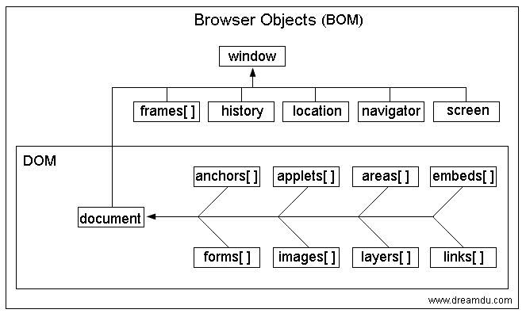

# BOM

BOM : (Bower Object Model) 浏览器对象模型

BOM 提供了独立于内容, 而与浏览器窗口进行交互的对象<br>
由于BOM主要用于管理窗口与窗口之间的通讯，因此其核心对象是window；<br>
BOM由一系列相关的对象构成，并且每个对象都提供了很多方法与属性；<br>
BOM缺乏标准，JavaScript语法的标准化组织是ECMA，DOM的标准化组织是W3C初是Netscape浏览器标准的一部分。

## 学习BOM学什么

我们将学到与浏览器窗口交互的一些对象，例如
- 可以移动、调整浏览器大小的 `window` 对象，
- 可以用于导航的location对象与 `history` 对象，
- 可以获取浏览器、操作系统与用户屏幕信息的 `navigator` 与 `screen` 对象，
- 可以使用 `document` 作为访问HTML文档的入口，
- 管理框架的 `frames` 对象等。



## window对象

window对象代表浏览器打开的一个窗口

- Window对象的属性
    + closed  返回布尔值，表示窗口是否关闭
    + defaultStatus   设置或返回浏览器下方状态栏中的默认文本
    + document    返回window的文档对象（详细参照 DOM参考手册）
    + frameElement    返回当前窗口中插入的iframe元素
    + frames  返回当前文档中代表iframe元素的类似矩阵的对象
    + history 返回窗口的历史对象（详细参照 History对象）
    + innerHeight 返回窗口内容领域内高度
    + innerWidth  返回窗口内容领域内宽度
    + length  返回当前文档中iframe元素的数量
    + location    返回window的Location对象（详细参照 Location对象）
    + name    设置或返回窗口的名称
    + navigator   返回窗口的Navigator对象
    + opener  返回创建窗口的基准
    + outerHeight 返回窗口的高度，包括窗口界面上的所有元素
    + outerWidth  返回窗口的宽度，包括窗口界面上的所有元素
    + pageXOffset 返回当前文档滚动条在水平方向上的滚动距离
    + pageYOffset 返回当前文档滚动条在垂直方向上的滚动距离
    + parent  返回当前窗口的上级窗口
    + screen  返回window的Screen对象（详细参照 Screen对象）
    + screenLeft  回窗口相对于屏幕的x坐标
    + screenTop   回窗口相对于屏幕的y坐标
    + screenX 返回窗口相对于屏幕的x坐标
    + screenY 返回窗口相对于屏幕的y坐标
    + scrollX 与pageXOffset相同
    + scollY  与pageYOffset相同
    + self    返回当前窗口
    + status  设置或返回浏览器下端窗口状态栏中显示的信息
    + top 返回当前窗口的最上级窗口

- Window对象的方法
    + alert() 显示警告对话窗口
    + atob()  使用base64的形式解码
    + blur()  从当前窗口删除聚焦
    + btoa()  使字符编码成base64的形式
    + clearInterval() 清除使用setInterval()方法设置的计时器
    + clearTimeout()  清除使用setTimeout()方法设置的计时器
    + close() 关闭当前浏览器窗口
    + confirm()   显示带有自定义信息、ok、取消按钮的确认对话框
    + focus() 聚焦到当前窗口
    + moveBy()    相对于窗口当前坐标位置,根据指定距离移动窗口
    + moveTo()    根据指定距离移动窗口
    + open()  打开新的浏览器窗口
    + print() 打印当前窗口中的内容
    + prompt()    显示带有输入框的提示对话框
    + resizeBy()  在当前窗口尺寸上追加指定的宽度和高度
    + resizeTo()  指定窗口的宽度和高度
    + scroll()    不推荐使用；该方法由scrollTo()代替
    + scrollBy()  移动窗口滚动条到指定的位置
    + scrollTo()  窗口滚动条移动到指定的坐标
    + setInterval()   调用一个函数或者指定时间间隔计算表达式
    + setTimeout()    调用一个函数或者指定时间计算表达式

## 系统对话框

- window.alert() //不同浏览器中的外观是不一样的
- window.confirm()
- window.prompt() //不推荐使用

## 窗体事件

- window.onload : 窗体加载完成事件

## 打开和关闭窗口

- window.open( url, target, param)
    + url 要打开的地址
    + target新窗口的位置 _blank  _self  _parent(父框架)
    + param 新窗口的一些设置
    + 返回值，新窗口的句柄
`win = window.open("http://www.baidu.com", "_blank", "width=200,height=200");`
- window.close()  关闭窗口

## 定时器

### 定时执行

- 设置定时器 `var timerId = setInterval(code,interval);`
- 清除定时器 `clearInterval(timerId);`
- 间隔时间执行，不是特别精确

### 延迟执行

- 设置定时器:`var timerId = setTimeout(code,interval);`
- 清除定时器:`clearTimeout(timerId);`

## location 对象

- `window.location`
    + location相当于浏览器地址栏
    + 可以将url解析成独立的片段
- location对象的属性
    + window.location.href
    + window.location.hash;//哈希值
    + window.location.host;//主机
    + window.location.hostname;//主机名
    + window.location.pathname;//路径名
    + window.location.port;//端口号
    + window.location.protocol;//协议
    + window.location.search;//参数
- location对象的方法
    + assign()    下载一个新文档
    + reload()    刷新当前文档
    + replace()   下载新文档覆盖当前文档

统一资源定位符 (Uniform Resource Locator, URL) <br>
完整的URL由这几个部分构成：`scheme://host:port/path?query#fragment`
- scheme:通信协议 ==> 常用的http,ftp,maito等
- host:主机(带端口号) ==> 服务器(计算机)域名系统 (DNS) 主机名或 IP 地址。
- port:端口号 ==> 整数，可选，省略时使用方案的默认端口，如http的默认端口为80。
- path:路径 ==> 由零或多个"/"符号隔开的字符串，一般用来表示主机上的一个目录或文件地址。
- query:查询 ==> 可选，用于给动态网页（如使用CGI、ISAPI、PHP/JSP/ASP/ASP.NET等技术制作的网页）传递参数，可有多个参数，用"&"符号隔开，每个参数的名和值用"="符号隔开。
- fragment:信息片断 ==> 字符串，用于指定网络资源中的片断。例如一个网页中有多个名词解释，可使用fragment直接定位到某一名词解释。(也称为锚点.)

```js
//假设当前的 URL 是: http://example.com:1234/test/test.html?name="Jack"&age=18#part2
console.log(location.hash)     // #part2
console.log(location.host)     // example.com:1234
console.log(location.hostname) // example.com
console.log(location.href)     // http://example.com:1234/test.html?name="Jack"&age=18#part2
console.log(location.pathname) // /test/test.html
console.log(location.port)     // 1234
console.log(location.portocol) // http:
console.log(location.search)   // ?name="Jack"&age=18
```

## navigator 对象

- 属性
    + appCodeName  返回浏览器的代码名称
    + appName  返回浏览器的名称
    + appVersion  返回浏览器的版本信息
    + cookieEnabled   确定是否启动浏览器的cookies
    + geolecation 返回用于定位用户位置的Geolocation对象
    + language    返回浏览器的语言版本
    + onLine  返回布尔值，表示浏览器是在线工作还是离线工作
    + platform    返回浏览器被编译的平台
    + product 返回浏览器的引擎名称
    + userAgent   返回由浏览器向服务器发送的用户代理头文件
    `console.log(navigator.userAgent);//可以查看用户端的相关信息`
- 方法
    + javaEnabled()   浏览器是否启动了Java
    + taintEnabled()  JavaScript 1.2.版本已经删除

## history 对象

- 属性
    + length  返回浏览历史列表中URL的数量
- 方法
    + back()  加载浏览历史列表中之前的URL（网址）
    + forward()   加载浏览历史列表中之后的URL（网址）
    + go()    从浏览历史列表中加载指定的URL（网址)


- 后退
    + history.back()
    + history.go(-1)
- 前进
    + history.forward()
    + history.go(1)

## screen

- width   返回屏幕的总体宽度
- height  返回屏幕的总体高度
- availHeight 返回屏幕的高度（不包括窗口的任务栏）
- availWidth  返回屏幕的宽度（不包括窗口的任务栏）
- colorDepth  返回屏幕陈列图像时的颜色深度
- pixelDepth  返回屏幕的彩色分辨率
