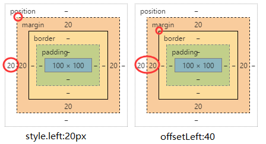
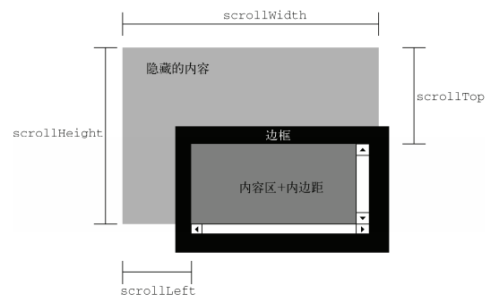

# js特效

## 知识点

### offset(偏移)

#### offset常用属性:

- 以下均为只读;获取的数据只是数值,没有单位(style获取的有单位);
- `offsetWidth` : 可获得对象的宽度(style.width只能获得行内样式中的宽度)
    + `offsetWidth = width + padding + border`
- `offsetHeight` : 可获得对象的高度
- `offsetParent`: 可获得对象的距离最近的带有定位的父级
    + 另外注意offsetParent与parentNode的区别parentNode只找自己的上一级（亲爹）
- `offsetLeft` : 自身border左侧到父级padding左侧的距离;如果所有父级都没有定位则以body 为准
    + offsetLeft以border左上角为基准,style.left以margin左上角为基准

  


- `offsetTop` : 到距离自身最近的（带有定位的）父元素的 左侧/顶部 的距离
如果所有父级都没有定位则以body 为准


#### 动画原理(offset的应用)

`动画原理公式: leader = leader + step`
    - leader : 表示盒子当前位置
    - step: 表示步长
```js
setInterval(function(){
    box.style.left = box.offsetLeft + 10 + "px";
},100)
//盒子的一直在偏移,实现初步的动态效果
```

#### 缓动动画

动画原理公式: 
`leader = leader + step`
匀速动画公式:
```js
step = 定值
leader = leader + step
```
缓动动画公式:
```js
step = (target - leader) / 10
leader = leader + step
```


### scroll(卷曲)

#### scroll常用属性:

- `scrollHeight` : 对象内部实际内容的高度
- `scrollWidth` : 对象内部实际内容的宽度
- `scrollTop` : 对象被卷去部分的 顶部 到可视区域 顶部 的距离
- `scrollLeft` : 对象被卷去部分的 左侧 到可视区域 左侧 的距离



#### 封装页面滚动坐标的兼容写法

```js
var scrollTop = window.pageYOffset || document.documentElement.scrollTop || document.body.scrollTop || 0;

//封装 可以获取任意浏览器中页面滚动坐标的兼容函数
function scroll() {
    return {
        top: window.pageYOffset || document.documentElement.scrollTopdocument.body.scrollTop || 0,
        left: window.pageXOffset || document.documentElement.scrollLeftdocument.body.scrollLeft || 0
    };
}
scroll().top
```

### client(可视)

#### client常用属性

- clientWidth : 可视区宽度
- clientHeight : 可视区高度
- clientTop : 没什么用,就是borderTop
- clientLeft : 没什么用,就是borderLeft(如果有滚动条会包含滚动条的宽度,但谁见过滚动条在顶部或者左侧的?!)


#### client、offset、scorll比较

- 偏移offsetWidth: width  +  padding  +  border
- 卷曲scrollWidth: width  +  padding  不包含border   内部内容的大小
- 可视clientWidth: width  +  padding  不包含border


#### 网页可视区宽高的兼容写法

网页可视区高度

- 正常浏览器 ==> window.innerWidth  
- IE6（标准模式）==> document.documentElement.clientWidth(类似html.clientWidth)
- IE6（怪异模式）==> document.body.clientWidth(类似body.clientWidth)

```js
var clientWidth = window.innerWidth|| document.documentElement.clientWidth|| document.body.clientWidth|| 0;

function client() {
    return {
        width: window.innerWidth || document.documentElement.clientWi|| document.body.clientWidth || 0,
        height: window.innerHeight || document.documentElemclientHeight || document.body.clientHeight || 0
    };
}
```

### event 事件对象

在触发事件时，会产生一个事件对象event，这个对象中包含着与事件有关的信息。

#### 兼容处理

- 普通浏览器支持 event
- ie 678 支持 window.event

#### event对象常用属性
   
- data    : 返回拖拽对象的URL字符串（dragDrop） 
- width   : 该窗口或框架的高度 
- height  : 该窗口或框架的高度 
- pageX   : 光标相对于该网页的水平位置（ie无） 
- pageY   : 光标相对于该网页的垂直位置（ie无） 
- screenX : 光标相对于该屏幕的水平位置 
- screenY : 光标相对于该屏幕的垂直位置 
- target  : 该事件被传送到的对象 
- type    : 事件的类型 
- clientX : 光标相对于该客户区的水平位置  
- clientY : 光标相对于该客户区的垂直位置 

### 三个重要坐标

- screenX --- screenY :屏幕的坐标
- clientX --- clientY :窗口(浏览器)的坐标
- pageX --- pageY  : 页面的坐标

```js
document.onclick = function(event){
    var event = event | window.event;
    console.log(screenX , screenY) ;  //鼠标在屏幕的坐标
    console.log(clientX , clientY) ;  //鼠标相对于窗口(浏览器)的坐标
    console.log(pageX , pageY) ;  //鼠标相对于当前页面的坐标(当页面出现scrollTop时,会与clientY不一样,否则二者基本一样)

    //page的兼容性处理
    var pageX = event.pageX || event.clientX + document.documentElement.scrollLeft;
    var pageY = event.pageY || event.clientY + document.documentElement.scrollTop;
}


```

### 清除选中的内容

清除选中的内容
- 正常浏览器支持：window.getSelection() 
- IE678以下支持：document.selection

```js
window.getSelection ? window.getSelection().removeAllRanges() : document.
selection.empty();
```
 


## 特效案例

### 动画函数封装

```js
function animate(obj, target) {
    clearInterval(obj.timer);
    obj.timer = setInterval(function () {
        var leader = obj.offsetLeft;
        var step = 10;
        step = leader < target ? step : -step;//往左往右都行
        if (Math.abs(leader - target) >= Math.abs(step))距离大于步长就可以走
            leader = leader + step;
            obj.style.left = leader + "px";
        } else {
            obj.style.left = target + "px";//手动放到目标上
            clearInterval(obj.timer);
        }
    }, 15);
}
```

### 缓动动画函数封装

```js
function animate(obj, target) {
    clearInterval(obj.timer);
    obj.timer = setInterval(function () {
        var leader = obj.offsetLeft;
        var step = (target - leader) / 10;
        step = step > 0 ? Math.ceil(step) : Math.floor(step);
        leader = leader + step;
        obj.style.left = leader + "px";
        if (leader === target) {
            clearInterval(obj.timer);
        }
    }, 15);
}
```

增加一些其他属性的缓动效果

```js
function animate(obj, json, fn) {
    clearInterval(obj.timer);
    obj.timer = setInterval(function () {
        var flag = true;
        for (var k in json) {
            if (k === "opacity") {         //单独处理透明度
                var leader = getStyle(obj, k) * 100;
                //没必要给默认值 也不应该给
                var target = json[k] * 100;
                var step = (target - leader) / 10;
                step = step > 0 ? Math.ceil(step) : Math.floor(step);
                leader = leader + step;
                obj.style[k] = leader / 100;
                //之前扩大100倍 现在缩小100倍数 透明度没有单位
            } else if (k === "zIndex") {             //层级也要特殊处理
                obj.style.zIndex = json[k];          //层级不需直接设置成目标值
            } else {
                var leader = parseInt(getStyle(obj, k)) || 0;
                var target = json[k];
                var step = (target - leader) / 10;
                step = step > 0 ? Math.ceil(step) : Math.floor(step);
                leader = leader + step;
                obj.style[k] = leader + "px";
            }
            if (leader !== target) {
                flag = false;
            }
        }
        if (flag) {                  //最后任然是true 说明都到了
            clearInterval(obj.timer);//清理定时器
            if (fn) {               //如果有才调用
                fn();              //动画执行完成后 会执行传入的回调函数
            }
        }
    }, 15);
}
```

### 完整轮播

 克隆第一张图片放到最后一张的后面,造成一种视觉差,让人们以为是从最后一张跳到第一张,其实是跳到了克隆的这张,然后瞬间回到了跳到了第二张,因为有第二张的第一张做缓冲,会以为是正常的轮播

```js
    var timer = null;
    {  //图片的一些基本信息
        var box = document.getElementById("box");
        var screen = box.children[0];
        var ul = screen.children[0];
        var ol = screen.children[1];
        var ulLis = ul.children;//所有的广告 
    }
    {  //关于左右切换图片
        var arr = document.getElementById("arr");
        var left = document.getElementById("left");
        var right = document.getElementById("right");
        var imgWidth = screen.offsetWidth;
    }
    //根据图片数量动态创建
    for (var i = 0; i < ulLis.length; i++) {
        var li = document.createElement("li");
        li.innerHTML = i + 1;
        ol.appendChild(li);
    }
    //对应图片的小圆点高亮
    var olLis = ol.children;
    olLis[0].className = "current"; 
    var firstImg = ulLis[0].cloneNode(true); 
    ul.appendChild(firstImg);
    for (var j = 0; j < olLis.length; j++) {
        olLis[j].index = j;
        olLis[j].onmouseover = function () {
            for (var k = 0; k < olLis.length; k++) {
                olLis[k].className = "";
            }
            this.className = "current";
            var target = -this.index * imgWidth;
            animate(ul, target);
            pic = square = this.index;
        };
    }
    //鼠标经过图片,自动轮播停止
    box.onmouseover = function () {
        arr.style.display = "block";
        clearInterval(timer);
    };
    //鼠标移出图片,自动轮播继续
    box.onmouseout = function () {
        arr.style.display = "none";
        timer = setInterval(right.onclick, 1000);
    };
    var pic = 0;
    var square = 0;
    // 右箭头点击,图片右移
    right.onclick = function () {
        if (pic === ulLis.length - 1) {
            ul.style.left = 0 + "px";
            pic = 0;
        }
        pic++;
        var target = -pic * imgWidth;
        animate(ul, target);
        if (square < olLis.length - 1) {
            square++;
        } else {
            square = 0;
        }
        for (var i = 0; i < olLis.length; i++) {
            olLis[i].className = "";
        }
        olLis[square].className = "current";
    };
    //左箭头点击,图片左移
    left.onclick = function () {
        if (pic === 0) {
            ul.style.left = -(ulLis.length - 1) * imgWidth + "px";
            pic = ulLis.length - 1;
        }
        pic--;
        var target = -pic * imgWidth;
        animate(ul, target);
        if (square > 0) {
            square--;
        } else {
            square = olLis.length - 1;
        }
        for (var i = 0; i < olLis.length; i++) {
            olLis[i].className = "";
        }
        olLis[square].className = "current";
    };
    timer = setInterval(right.onclick, 1000);
    //动画函数
    function animate(obj, target) {
        clearInterval(obj.timer);
        obj.timer = setInterval(function () {
            var leader = obj.offsetLeft;
            var step = 30;
            step = leader < target ? step : -step;
            if (Math.abs(leader - target) >= Math.abs(step)) {
                leader = leader + step;
                obj.style.left = leader + "px";
            } else {
                obj.style.left = target + "px";
                clearInterval(obj.timer);
            }
        }, 15);
    }
```