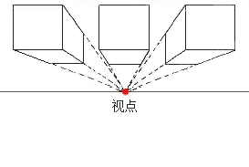

# HTML5 + CSS3

## H5新标签

### 语义标签：

- article : `<article>定义文章</article>`
- aside : `<aside>定义文章侧边栏</aside>`
- figure : `<figure>定义一组媒体对象以及文字内容</figure>`
- figcaption : `<figcaption>定义figure的标题</figcaption>`

布局页面时用的语义标签：

- nav : `<nav>定义导航</nav>`
- header : `<header>头部</header>`
- main: `<main>身体</main>` 
- section : `<section>定义文档中的区段 区域</section>`
- footer `<footer>尾部</footer>`

### input其他的类型type：

1. text ：文本输入框
2. password ：密码
3. button ：按钮
4. checkbox ：复选
5. radio ：单选
6. submit ：提交
7. reset ：重置
8. file ：文件
9. email ：输入邮箱地址 检测@(自带验证,输入格式不正确,会有提示)
10. url ：URL地址
11. number ：只能输入数字 还有e
12. range ：范围 默认0~100
13. date ：日期
14. month ：月
15. color ：颜色
16. search ：搜索
17. tel ：电话

### form新表单属性

1. placeholder ：文本框提示 `placeholder="请输入姓名"`
2. multiple : 多选,需配合 `type="file"` ==> `<input type="file" multiple>`
3. autocomplete : 自动完成(当您在输入域中输入时，自动完成（Autocomplete）部件提供相应的建议。在本实例中，提供了编程语言的建议选项) 
    - 需要设置name属性
    - 在点击提交过之后才能给提示
4. autofocus : 自动聚焦 `<input type="email">`(一般一个页面只设置一个)
5. required : boolean属性; 非空验证属性,在提交时会验证,是否输入了内容
6. pattern : 自定义验证规则,正则表达式
7. min,max: 限制最大数,最小数
8. list : 值为datalist标签的ID名,设置属性关联
```js
<input type="tel" list="telList" placeholder="请输入电话"/>
<datalist id="telList">
    <option value="18119839292"></option>
    <option value="12343839292"></option>
</datalist>
```

### 自定义表单验证 (required)

```html
<form action="#">
    <input type="tel" name="tel" id="telInput" placeholder="请输入电话" pattern="\d{4}">
    <input type="submit" value="提交">
</form>
<script>
    // 验证失败以后触发
    document.getElementById("telInput").oninvalid = function(){
        //自定义验证信息方法
        this.setCustomValidity("请输入4个数字");
    }
    // 用户输入的时候触发
    document.getElementById("telInput").oninput = function(){
        var input = this.value;
        var reg = /\d{4}/;
        if(reg.test(input)){
            //输入正确的提示信息
        }
        //清空提示信息 ,可解决oninvalid自定义提示信息一直显示的问题
        this.setCustomValidity('');
    }
</script>
```

### 音频,视频

- video
    + src: 资源路径
    + autoplay:自动播放
    + controls:控制器
    + loop:循环播放
    + width:video标签宽度,视频宽度不变
    + height:video标签高度,视频高度不变
    + source:指定多个文件资源
    + 缺点:视频可以直接另存为...
- audio
    + src: 资源路径
    + autoplay:自动播放
    + controls:控制器
    + loop:循环播放
    + source:指定多个文件资源
    + 不能设置width,height
    + 缺点:视频可以直接另存为...

```js
<video controls autoplay loop width='200px' height='300px'>
    <source src="movie1.ogg"></source>
    <source src="movie.mp4"></source>
    您的版本过低,请升级下载 <a href="#">点击下载</a>
</video>

<audio autoplay controls loop>
    <source src='music/music.ogg'></source>
    <source src='music/郝云 - 活着.mp3'></source>
</audio>
```

#### 自定义播放器外观

首先了解一下video/audio的方法、属性和事件

方法：
- addTextTrack() ： 向音频/视频添加新的文本轨道
- canPlayType()  ： 检测浏览器是否能播放指定的音频/视频类型
- load() ： 重新加载音频/视频元素
- play() ： 开始播放音频/视频
- pause()： 暂停当前播放的音频/视频

属性:
- audioTracks ：返回表示可用音轨的 AudioTrackList 对象
- autoplay    ：设置或返回是否在加载完成后随即播放音频/视频
- buffered    ：返回表示音频/视频已缓冲部分的 TimeRanges 对象
- controller  ：返回表示音频/视频当前媒体控制器的 MediaController 对象
- controls    ：设置或返回音频/视频是否显示控件（比如播放/暂停等）
- crossOrigin ：设置或返回音频/视频的 CORS 设置
- currentSrc  ：返回当前音频/视频的 URL
- currentTime ：设置或返回音频/视频中的当前播放位置（以秒计）
- defaultMuted    ：设置或返回音频/视频默认是否静音
- defaultPlaybackRate ：设置或返回音频/视频的默认播放速度
- duration    ：返回当前音频/视频的长度（以秒计）
- ended   ：返回音频/视频的播放是否已结束
- error   ：返回表示音频/视频错误状态的 MediaError 对象
- loop    ：设置或返回音频/视频是否应在结束时重新播放
- mediaGroup  ：设置或返回音频/视频所属的组合（用于连接多个音频/视频元素）
- muted   ：设置或返回音频/视频是否静音
- networkState    ：返回音频/视频的当前网络状态
- paused  ：设置或返回音频/视频是否暂停
- playbackRate    ：设置或返回音频/视频播放的速度
- played  ：返回表示音频/视频已播放部分的 TimeRanges 对象
- preload ：设置或返回音频/视频是否应该在页面加载后进行加载
- readyState  ：返回音频/视频当前的就绪状态
- seekable    ：返回表示音频/视频可寻址部分的 TimeRanges 对象
- seeking ：返回用户是否正在音频/视频中进行查找
- src ：设置或返回音频/视频元素的当前来源
- startDate   ：返回表示当前时间偏移的 Date 对象
- textTracks  ：返回表示可用文本轨道的 TextTrackList 对象
- videoTracks ：返回表示可用视频轨道的 VideoTrackList 对象
- volume  ：设置或返回音频/视频的音量

事件:
- abort   ：当音频/视频的加载已放弃时
- canplay ：当浏览器可以播放音频/视频时
- canplaythrough  ：当浏览器可在不因缓冲而停顿的情况下进行播放时
- durationchange  ：当音频/视频的时长已更改时
- emptied ：当目前的播放列表为空时
- ended   ：当目前的播放列表已结束时
- error   ：当在音频/视频加载期间发生错误时
- loadeddata  ：当浏览器已加载音频/视频的当前帧时
- loadedmetadata  ：当浏览器已加载音频/视频的元数据时
- loadstart   ：当浏览器开始查找音频/视频时
- pause   ：当音频/视频已暂停时
- play    ：当音频/视频已开始或不再暂停时
- playing ：当音频/视频在已因缓冲而暂停或停止后已就绪时
- progress    ：当浏览器正在下载音频/视频时
- ratechange  ：当音频/视频的播放速度已更改时
- seeked  ：当用户已移动/跳跃到音频/视频中的新位置时
- seeking ：当用户开始移动/跳跃到音频/视频中的新位置时
- stalled ：当浏览器尝试获取媒体数据，但数据不可用时
- suspend ：当浏览器刻意不获取媒体数据时
- timeupdate  ：当目前的播放位置已更改时
- volumechange    ：当音量已更改时
- waiting ：当视频由于需要缓冲下一帧而停止


自定义播放器用到的几个video属性方法
- video.play() : 播放
- video.pause(): 暂停
- video.ontimeupdate : 事件,当目前的播放位置已更改时
- video.currentTime: 返回当前播放位置(以秒计)
- video.duration:返回当前音频/视频的长度（以秒计）
- 

```js
    <body>
        <div class='myPlayer'>
            <video ></video>
            <div class="controls">
                <!-- 播放键 -->
                <a href="#" class='icon-play-circle play'></a>
                <!-- 暂停键 -->
                <a href="#" class='icon-pause pause'></a>
                <!-- 进度条 -->
                <div class="progress">
                    <div class="step"></div>
                </div>
                <!-- 全屏 -->
                <a href="#" class='icon-fullscreen fullscreen'></a>
            </div>
        </div>
    </body>
</html>
<script type="text/javascript">  
    var video = document.querySelector('video');
    // 1. 播放
    document.querySelector('.play').onclick = function (){
        if(video.src==''){   // 设置播放的视频
            video.src = 'movies/movie02.mp4';
        }
        video.play();     // 播放视频
    }  
    // 2. 暂停
    document.querySelector('.pause').onclick = function (){  
        // 播放视频
        video.pause();
    }  
    // 播放的时候 一直执行
    video.ontimeupdate = function (){
        // 总时间
        // 当前时间
        // 计算成 百分比即可 0-1的小数 并换算成百分数
        var percent = video.currentTime / video.duration *100 +"%";
        // 设置给 进度条中的 那个 div 0-100%
        document.querySelector('.step').style.width = percent;
    }
    // 3.点击进度条跳转
    document.querySelector('.progress').onclick = function (e){
        // 进度条点击的位置占总进度条百分比
        var percent = e.offsetX/this.offsetWidth*100+'%';
        // 将百分比 设置给 进度条的宽度
        document.querySelector('.step').style.width = percent;
        // 修改视频的播放进度
        // 使用百分比 * 总时间 换算成 当前时间
        // percent 是一个字符串
        // 计算一下 时间
        video.currentTime = video.duration * e.offsetX/this.offsetWidth;
    }
    // 4.点击全屏
    document.querySelector('.fullscreen').onclick = function (){
        if(video.requestFullscreen){
            video.requestFullscreen();
        }else if(video.webkitRequestFullScreen){
            // 如果 在谷歌里面全屏 
            // 可以再这里 指定 dom元素的大小
            video.webkitRequestFullScreen();
        }else if(video.msRequestFullscreen){
            video.msRequestFullscreen();
        }else if(video.mozRequestFullScreen){
            video.mozRequestFullScreen();
        }
    }
</script>
```

### 自定义属性

html标签中 我们能够添加自定义属性 ,但是不同的人,不同的命名风格会造成后期阅读以及维护的麻烦,HTML5中推出了一个推荐的数据格式`data-*`:给自定义的属性加一个前缀data. <br>
例如: data-price, data-room, data-ab-youdao, data-xx-xxx-xx... <br>
但在实际生成的时候,会去掉第一个`data-`,后面的中间的`-`,`字母变大写`;如:abYoudao,meatOneTwo... <br>

**element.dataset用于获取自动以标签属性**

DOM获取自定义属性
```js
<li id='noodle'  data-Vegetable='green' data-meat-Twoprice='20'   data-price='10' data-color='white'>兰州拉面</li>
<script>
    var noodle = document.querySelector("#noodle");
    // 所有通过 data-添加的属性 都保存在 dataset这个属性中
    console.log(noodle.dataset);
    // 可以通过.语法获取
    console.log(noodle.dataset.color);  // white
    // 也能够通过 [key]的方式获取
    console.log(noodle.dataset['price']);  // 10
    // 获取 三块肉的价格  多个-拼接的属性
    console.log(noodle.dataset['meatTwoprice']); // 20
</script>
```

## h5标签的兼容问题

### 使用js创建标签

不建议使用,可能需要创建许多标签
```js
<script>
    var header = document.createElement("header");
    document.body.appendChild(header)
</script>
```

使用js的方式兼容低版本IE <br>    
条件注释(hack写法),将上面的代码注释,当浏览器无法识别h5标签时,会执行条件注释中的语句<br>
emmet语法 : `cc:ie6+tab`

```js
// lte (less than equal) 小于等于
// lt(小于)
// gt(大于)
// gte(大于等于)
<!--[if lte IE 6]> //将6改为8,就可以兼容IE678
    <script>
        var header = document.createElement("header");
        document.body.appendChild(header)
    </script>
<![endif]-->
```

### 插件 html5shiv.js

去GitHub下载html5shiv插件,然后直接引用html5shiv.js插件即可,再写h5新语义标签将能够被低版本的IE兼容

```js
<script src="html5shiv.js"></script>
```

在低版本的IE中完成创建标签的功能 , 并且会自动添加上display:block,有多个的话,也会自动帮助我们生成

```html
<!-- 使用条件注释 让下列js文件只在低版本 的ie中导入 -->
<!--[if lte IE 6]>
    <script src="html5shiv.js"></script>
<![endif]-->
```

### 功能标签：

- video : `<video src="" autoplay自动播放 controls控制播放 loop是否重复播放 preload是否自动加载>定义视频</video>`
- audio : `<audio src="">定义音频</audio>`
- mark : `<mark>标记</mark>`
- iframe : `<iframe src="" frameborder="0">内嵌网页框架</iframe>`
- canvas : `<canvas>定义图形提供画布</canvas>`

### 全屏模式 (requestFullScreen())

```js
//全屏模式的兼容代码
document.querySelector(".btn").onclick= function(){
    if(this.requestFullscreen){
        this.requestFullscreen();
    }else if(this.webkitRequestFullScreen){
        this.webkitRequestFullScreen();
    }else if(this.msRequestFullscreen){
        this.msRequestFullscreen();
    }else if(this.mozRequestFullScreen){
        this.mozRequestFullScreen();
    }
}
//退出全屏
function exitFullscreen() {
    if(document.exitFullscreen) {
     document.exitFullscreen();
    }else if(document.mozCancelFullScreen) { //兼容moz
     document.mozCancelFullScreen();
    }else if(document.webkitExitFullscreen) { //兼容webkit
     document.webkitExitFullscreen();
    }
}
```

### 读取文件

```js
<input type="file" >
<input type="button" value="读取文件">
<script>
    document.querySelector('input[value=读取文件]').onclick = function(){
        //1.获取选择的文件
        var fileDom = document.querySelector('input[type=file]').files[0];
        //2.创建读取文件的对象
        var reader = new FileReader();
        //3.获取选择文件内容   reader.readAsText(fileDom);
        //3.获取选择文件路径   
        reader.readAsDataURL(fileDom);
        //4.由于读取文件的耗时不可知,所以调用onload事件
        reader.onload = function(){
            //5.获取文件结果   reader.result
            //5.输出文件结果   console.log(reader.result);
            //5.将选择文件设置为背景图片
            document.body.style.background = 'url('+ reader.result +')'
        }
    }
</script>
```

### 文件拖拽

```html
//文件div拖拽需要给div加一个属性允许拖拽 draggable="true"
<div class="color" draggable="true"></div>

//阻止默认事件
document.querSelector(".box").ondragover = function(e){
    e.preventDefault();
}
document.querySelecor(".box").ondrop = function(e){
    //若是拖拽桌面文件,需要加阻止默认事件
    e.preventDefault();
    // 1. 创建读取文件对象
    var reader = new FileReader();
    // 2. 获取得到的文件
    // 2.1 获取的是页面拖拽文件
    var fileDom = docuement.querySelector("div").files[0];
    // 2.2 获取的是桌面拖拽文件
    var dropDom = e.dataTransfer.files[0];
    // 3. 调用读取方法
    reader.readerAsDataURL(fileDom|dropDom);
    // 4. 注册事件
    reader.onload = function(){
       //5.获得读取文件结果  reader.result
       //6.执行想要的结果;
    }
}

```


## CSS3

### 浏览器兼容

- -o-属性 : opera
- -ms-属性 : IE
- moz-属性  : Firefox
- webkit-属性  : safari和chrome

### 属性选择器

    ```
    属性名为att
    E[att]:        包含att属性
    E[att="val"]:  属性值为val
    E[att~="val"]: 属性值使用空格进行分割,有一个val
    E[att^="val"]: 属性值以val开头
    E[att$="val"]: 属性值以val结尾
    E[att*="val"]: 属性中包含val
    E[att|="val"]: 属性以'-'分割,其中有val值(如果属性只有val,那么也会被选中)
    ```

实例:

```html
<!DOCTYPE html>
<html lang="en">
<head>
  <meta charset="UTF-8">
  <title>Document</title>
  <style type="text/css">
    /* 包含skill属性 */
    li[skill]{                    /* <li skill="喷火">葫芦娃</li> */
        background-color: red;
    }
    /* color属性为white */
    li[color = "white"]{          /* <li color = "white">海尔兄弟</li> */
        background-color: blue;
    }
    /* color属性以空分割,有一个red */
    li[color~="red"]{            /* <li color = "blue red">舒克和贝塔</li> */
        background-color: orange;
    }
    /* color属性以bla开头 */
    li[color^="bla"]{    /* <li color = "black-orange">大头儿子小头爸爸</li> */
        border: 10px solid #0094ff;    /* <li color = "black">黑猫警长</li> */
    }
    /* color属性以ge结尾 */  
    li[color$="ge"]{  /* <li color = "black-orange">大头儿子小头爸爸</li> */
        font-size: 32px;
    }
    /* color属性中包含orange */
    li[color*="orange"]{ /* <li color = "black-orange">大头儿子小头爸爸</li> */
        color:orange;
    }
    /* color属性以'-'分割,包含black,如果只有black,也是 */
    li[color|="black"]{  /* <li color = "black-orange">大头儿子小头爸爸</li> */
        background-color: black;
    }
  </style>
</head>
<body>
  <ul>
      <li skill="喷火">葫芦娃</li>
      <li color = "black">黑猫警长</li>
      <li color = "white">海尔兄弟</li>
      <li color = "blue red">舒克和贝塔</li>
      <li color = "white gray">喜羊羊与灰太狼</li>
      <li color = "black-orange">大头儿子小头爸爸</li>
  </ul>
</body>
</html>
```

### 伪类选择器

#### 结构伪类

    ```
    E:first-child：父元素第一个子元素,并且是E标签
    E:last-child：父元素最后一个子元素,并且是E标签

    E:nth-child(n)： 第n个子元素，计算方法是E元素的全部兄弟元素；
    E:nth-last-child(n)： 跟E:nth-child(n)类似 ，只是倒着计算；
        n从0开始
        其中n的取值范围是：0，1,2,3,4...线性累加
        可以传入表达式，比如2n,2n+1等等
        可以传入特殊字符：even(偶数) odd(奇数)

    若E不是父元素中对应的first-child,last-child,,则不能实现对应关系,若不考虑E标签以为的其他F标签元素,则应该用first-of-child,last-of-child,nth-of-child()

    E:empty 指的是E标签没有子元素，并且内容为空
    E:not(选择器)：指的是，不满足括号内选择器条件的元素E
    ```

- 例子

```css
li:first-child{              <!-- 父元素中第1个元素,并且为li标签, -->
    color: red;
}
li:last-child{               <!-- 父元素中最后1个元素,并且为li标签 -->
    color:red;
}
li:nth-child(2){              <!-- 父元素中第2个元素,并且为li标签 -->
    color:blue;
}
li:nth-child(2n){             <!-- 父元素中第2,4,6,8...个元素,并且为li标签 -->
    color: blue;
}
li:nth-child(2n+1){           <!-- 父元素中第1,3,5,7...个元素,并且为li标签 -->
    color:red;
} 
li:nth-last-child(1){         <!-- 父元素中倒数第1个元素,并且为li标签 -->
    background-color: pink;
}
li:nth-last-child(2){         <!-- 父元素中最后2个元素,并且为li标签 -->
    background-color: yellow;
}
/*奇数*/
li:nth-child(odd){            <!-- 父元素中最后奇数个元素,并且为li标签 -->
    background-color: pink;
}
/*偶数*/
li:nth-child(even){            <!-- 父元素中最后偶数个元素,并且为li标签 -->
    background-color: skyblue;
}
/* not之后的括号内是选择器:li标签没有sex属性的,全部获取*/
li:not([sex]){
    background-color: hotpink;
}
<!-- 没有子元素的li标签 -->
li:empty{
    background-color: hotpink;
}
```

    ```
    E:first-of-type : 父元素中挑出所有E标签,然后选择第1个
    E:last-of-type :  父元素中挑出所有E标签,然后选择最后1个
    E:nth-of-type(n) :父元素中挑出所有E标签,然后选择第n个
    ```

- 例子

```html
h3:first-of-type{            <!-- 父元素中的所有h3标签,并且是h3标签的第一个 -->
    background-color: orange;
}
h3:last-of-type{          <!-- 父元素中的所有h3标签,并且是h3标签的最后一个 -->
    font-size: 8px;
    color: red;
}
h3:nth-of-type(3){          <!-- 父元素中的所有h3标签,并且是h3标签的第3个 -->
    background-color: hotpink
}
```

#### 目标伪类

    `E:target:选中当前锚点`

### 伪元素选择器

    ```
    E:first-letter/E::first-letter     设置对象内的第一个字符的样式
    E:first-line/E::first-line         设置对象内的第一行的样式

    E:before/E::before                 设置在对象前（依据对象树的逻辑结构）发生的内容。用来和content属性一起使用
    E:after/E::after                   设置在对象后（依据对象树的逻辑结构）发生的内容。用来和content属性一起使用

    {content: '';
    display: block;
    position: absolute;}  //结合::before和::after一起使用

    E::placeholder (CSS3新增属性)       设置对象文字占位符的样式
    E::selection   (CSS3新增属性)       设置对象被选择时的颜色
    ```

#### first-letter和first-line例子

快速生成测试文本,emmet语法 : lorem + tab

```
<p>Lorem ipsum dolor sit amet, consectetur adipisicing elit, sed do eiusmod
    tempor incididunt ut labore et dolore magna aliqua. Ut enim ad minimveniam,
    quis nostrud exercitation ullamco laboris nisi ut aliquip ex ea commodo
    consequat. Duis aute irure dolor in reprehenderit in voluptate velit esse
    cillum dolore eu fugiat nulla pariatur. Excepteur sint occaecat cupidatat non
    proident, sunt in culpa qui officia deserunt mollit anim id est laborum.</p>
p::first-letter{
    background-color: hotpink;
}

p::first-line{
    background-color: orange;
}
```

#### before和after示例

```
<style>
    div{
        width: 100px;
        height: 100px;
        margin: 0 auto;
        border: 1px solid gray;
        position: relative;
    }
    /* 伪元素选择器
        1.content 只要设置了 就能够看到
            内容不收限制 可以写空字符串
        2.伪元素是行内元素 为了设置宽高 
            需要变为块
            display:block;
            position:absolute;
        3.单标签不支持伪元素选择器
        4.伪元素选择器的作用
        作用是
            在不改变页面html结构的基础上,为其添加标签
        5.就只提供了 before 跟after 两个伪元素选择器
            只能添加这两个 没有什么 middle center等等写法
     */
    div::before{
        /* content属性 必须要设置 */
        content: '';
        display: block;
        position: absolute;
        background: url('images/sprites.png') no-repeat;
        width: 20px;
        height: 80px;
        left: -30px;
    }
    div::after{
        content: '';
        background-color: orange;
        width: 20px;
        height: 80px;
        position: absolute;
        right: -30px;
    }
    input::before{
        content: '123y';
    }
</style>
```

#### placeholder例子:css兼容
```
<input type="text" placeholder="占位符" />

input::-webkit-input-placeholder {     
    color: #999;
}
input:-ms-input-placeholder {          // IE10+
    color: #999;
}
input:-moz-placeholder {               // Firefox4-18
    color: #999;
}
input::-moz-placeholder {              // Firefox19+
    color: #999;
}
```

### CSS新样式

#### 边框圆角

**border-radius**

    ```
    合写
    border-radius:10px;           /*设置四周的圆角*/
    border-radius: 50px 10px;     /*上左下右,上右下左 */
    border-radius: 50px 30px 10px;   /*上左,上右下左,下右*/
    border-radius: 50px 40px 30px 20px;  /*上左,上右,下右,下左*/
    border-radius: 50px/100px;     /*上下的圆角/左右的圆角*/

    分开写
    border-top-left-radius: 40px;    /*上左*/
    border-top-right-radius: 10px;   /*上右*/
    border-bottom-left-radius: 20px;  /*下左*/
    border-bottom-right-radius: 50px; /*下右*/
    ```

#### 边框阴影

**box-shadow**

可选值:

    + h-shadow: 必需。水平阴影的位置。允许负值。
    + v-shadow: 必需。垂直阴影的位置。允许负值。
    + blur:     可选。模糊距离。
    + spread:   可选。阴影的尺寸
    + color:    可选。阴影的颜色。请参阅 CSS 颜色值。
    + inset:    可选。将外部阴影 (outset) 改为内部阴影

写法:

    ```
    box-shadow:-10px 20px red;    水平-10,垂直20,阴影颜色红
    box-shadow: 5px 5px 20px pink;
            /*x偏移值,y偏移值,影子四周模糊程度,影子颜色*/
    box-shadow: 5px 5px 0px 5px red;
            /*x偏移值,y偏移值,影子四周模糊程度,影子额外的长度,影子颜色*/
            /*影子默认跟元素一样大*/
    box-shadow: inset 0px 0px 100px yellow;
            /*添加了inset以后,影子会往内部伸展,其他的都是一样的*/
    box-shadow: 5px 5px yellow,-5px -5px blue,10px 10px green;
            /*多个影子的添加 只需要使用逗号分隔即可 */
    ```

#### 边框图片(border-image)

    - border-image-source  : 图片路径(url)
        + none：无背景图片。 
        + url： 图片地址
        + 渐变色
    - border-image-slice   : 图片切片大小
        + 1-4个值(不需要单位),对应的关系跟margin一致
        + 1-4个百分比,对应的关系跟margin一致
    - border-image-width   : 图片宽度
    - border-image-outset  : 图片边框向外延伸的值
        + 1-4个值,单位为(px,em,%),对应关系跟margin一致
    - border-image-repeat  : 图片重复
        + stretch： 拉伸填充边框。 
        + repeat： 平铺.当图片碰到边界时，如果超过则被截断。 
        + round： 指定用平铺方式来填充边框背景图。图片会根据边框的尺寸动态调整图片的大小,直至正好可以铺满整个边框。 
        + space： 指定用平铺方式来填充边框背景图。图片会根据边框的尺寸动态调整图片的之间的间距直至正好可以铺满整个边框。 
    - border-image: url("img/border_image_2.png") 17 / 17px / 17px round;

#### 字体阴影
 
**text-shadow**

可选值:

    + h-shadow: 必需。水平阴影的位置。允许负值。
    + v-shadow: 必需。垂直阴影的位置。允许负值。
    + blur:     可选。模糊距离。如果提供了第3个长度值则用来设置对象的阴影模糊值。不允许负值
    + color:    可选。阴影的颜色。请参阅 CSS 颜色值。
 
写法:

    ```
    text-shadow:5px 5px red
            /*x偏移值,y偏移值,阴影颜色*/
    text-shadow:5px 5px 10px pink
          /*x偏移值,y偏移值,阴影模糊程度,阴影颜色 */
    text-shadow:5px 5px red,10px 10px yellow; 
            /*多个影子的添加 只需要使用逗号分隔即可 */
    ```

### 过渡属性 transition

- transition-property : 检索或设置对象中的参与过渡的属性 
    + none : 不指定过渡的css属性 
    + all : 所有可以进行过渡的css属性 
    + 指定要进行过渡的css属性 (border,color,font-size,width...)
- transition-duration : 检索或设置对象过渡的持续时间 
    + time : 指定过渡的事件(2s, .5s, 100ms...)
- transition-timing-function : 检索或设置对象中过渡的类型
    + linear： 线性过渡
    + ease： 平滑过渡(默认)
    + ease-in： 由慢到快
    + ease-out： 由快到慢
    + ease-in-out： 由慢到快再到慢 
    + step-start： 等同于 steps(1, start) 
    + step-end： 等同于 steps(1, end) 
    + steps(<integer>[, [ start | end ] ]?)： 接受两个参数的步进函数。第一个参数必须为正整数，指定函数的步数。第二个参数取值可以是start或end，指定每一步的值发生变化的时间点。第二个参数是可选的，默认值为end。 
    + cubic-bezier(<number>, <number>, <number>, <number>)： 特定的贝塞尔曲线类型，4个数值需在[0, 1]区间内  
- transition-delay : 检索或设置对象延迟过渡的时间 
    + time： 指定对象过渡的延迟时间 (2s, .3s, 100ms...)

```
**合写**
transition:过渡CSS属性 持续时间 动画方式 延迟时间;
/* 多属性过渡组合写法  通过逗号分隔*/
transition:过渡1,过渡2....
```

```
transition: all 1s ease-in 1s;
    /* 所有属性 1s动画 ease-in动画方式 延迟1s*/
transition: all 1s;
    /* 所有属性1s动画*/
```

#### transition-timing-function 步骤动画

```css
div{
    background:url(img/key.png) no-repeat;
    width:0px;  // 给动画图片设置初始状态
    transtion:all 1s;
    transition-timing-function:step(5); //动画将分为五不执行 
}
body:hover div {
    width:100px;  //设置最终状态
}
//动画会从width:0px-->width:100px,经过五部显示完整
```

### 颜色设置

#### rgba

- red:0-255
- green:0-255
- blue:0-255
- alpha:0-1(小数)
- 注意,不使用a 那么认为没有透明度

```css
color:rgba(100, 100, 100, .5)
color:rgb(100, 100, 100)
```

#### hsla

- hue(色调) : 0-360
- saturation(饱和度):0-100%
- lightness(亮度):0-100%
- alpha(透明度):0-1(小数)

```css
color:hsla(308, 85%, 85%, 1);
color:hsla(308, 85%, 85%);
```

#### opacity(不透明度)

opacity只能针对整个盒子设置透明度，子盒子及内容会继承父盒子的透明度 ，他是作为CSS的属性来使用的

#### transparent(透明)

transparent始终完全透明，他是作为颜色的取值来使用`color:transparent`

### 渐变色 background

- 线性渐变(linear-gradient): 向下/向上/向左/向右/对角方向
- `background: linear-gradient(direction, color-stop1, color-stop2, ...);`

```css
/*语法组合方式 可以添加多个颜色*/
background-image: linear-gradient(方向,开始颜色 开始位置 ,颜色2 开始位置,颜色3 开始位置.....);

/* 具体代码  */

background-image: linear-gradient(to top left,red,yellow);  /* 朝着 右上角 从红色到黄色*/

background-image: linear-gradient(45deg,red,yellow);  /* 朝着 顺时针45度 从红色到黄色*/

background-image: linear-gradient(45deg,red,yellow,green); /* 朝着 顺时针45度 红色,黄色,绿色*/


background-image: linear-gradient(45deg,red 10px,yellow 20px); /* 朝着 顺时针45度 红色到 10px结束 黄色从 20px开始 */

background-image: linear-gradient(45deg,red 10%,yellow 20%);  /* 朝着 顺时针45度 红色到10%结束 黄色从 20%开始 */
```

- 径向渐变(radial-gradient): 指的是以某个点作为圆心,向四周扩散的渐变
- `background: radial-gradient(center, shape size, start-color, ..., last-color);`

```css
/* 圆形渐变写法 */
background:radial-gradient(半径  ,颜色1,颜色2等等);

/* 椭圆渐变写法 */
background:radial-gradient(横向半径,竖向半径  ,颜色1,颜色2等等);

/*具体代码*/
background:radial-gradient(100px,red,green);  /*半径100px 红色 绿色*/

background:radial-gradient(100px 200px,red,green); /*横向半径100px 竖向半径200px 红色 绿色*/

background:radial-gradient(100px 200px,red 10px,green 20px);/*横向半径100px  红色10px 绿色 20px*/

background:radial-gradient(100px 200px,red 10%,green 10%); /*横向半径100px  红色10% 绿色20%*/
```

### background新属性

#### background-size

- <length>： 用长度值指定背景图像大小。不允许负值。 
- <percentage>： 用百分比指定背景图像大小。不允许负值。 
- auto： 背景图像的真实大小。 
- cover： 将背景图像等比缩放到完全覆盖容器，背景图像有可能超出容器。 
- contain： 将背景图像等比缩放到宽度或高度与容器的宽度或高度相等，背景图像始终被包含在容器内。 

#### background-clip

- padding-box： 从padding区域（不含padding）开始向外裁剪背景。 
- border-box： 从border区域（不含border）开始向外裁剪背景。 
- content-box： 从content区域开始向外裁剪背景。 
- text： 从前景内容的形状（比如文字）作为裁剪区域向外裁剪，如此即可实现使用背景作- 为填充色之类的遮罩效果。

#### background-origin

- padding-box： 从padding区域（含padding）开始显示背景图像。 
- border-box： 从border区域（含border）开始显示背景图像。 
- content-box： 从content区域开始显示背景图像。 

#### background合写方式

**图像位置/图像尺寸**

```css
background:url(test1.jpg) no-repeat scroll 10px 20px/50px 60px content-box padding-box,
       url(test1.jpg) no-repeat scroll 10px 20px/70px 90px content-box padding-box,
       url(test1.jpg) no-repeat scroll 10px 20px/110px 130px content-box padding-box #aaa;
       /* 图片 是否重复 attachment 位置/尺寸 显示原点 向外裁剪区域 */
```

### background

- background : 复合属性。背景特性 
- background-color : 背景颜色 
- background-image : 背景图像 
- background-repeat : 图像如何铺排填充 ]
    + repeat-x： 横向平铺 
    + repeat-y： 纵向平铺 
    + repeat： 横向和纵向平铺 
    + no-repeat： 不平铺 
    + round： 背景图像自动缩放直到适应且填充满整个容器。（CSS3） 
    + space： 背景图像以相同的间距平铺且填充满整个容器或某个方向。（CSS3） 
- background-attachment : 图像是随对象内容滚动还是固定的
    + fixed：相对于窗体固定。 
    + scroll： 背景图像相对于元素固定，也就是说当元素内容滚动时背景图像不会跟着滚动，因为背景图像总是要跟着元素本身。但会随元素的祖先元素或窗体一起滚动。 
    + local： 背景图像相对于元素内容固定，也就是说当元素随元素滚动时背景图像也会跟着滚动，因为背景图像总是要跟着内容。（CSS3） 
- background-position : 图像位置 
    + <percentage>： 百分比
    + <length>： 长度值 
    + center： 横向和纵向居中 
    + left： 横向上填充从左边开始。 
    + right： 在横向上填充从右边开始 
    + top： 在纵向上填充从顶部开始 
    + bottom： 在纵向上填充从底部开始
- background-origin : 显示的原点 
    + padding-box： 从padding区域（含padding）开始显示背景图像。 
    + border-box： 从border区域（含border）开始显示背景图像。 
    + content-box： 从content区域开始显示背景图像。
- background-clip : 向外裁剪的区域 
    + padding-box： 从padding区域（不含padding）开始向外裁剪背景。 
    + border-box： 从border区域（不含border）开始向外裁剪背景。 
    + content-box： 从content区域开始向外裁剪背景。 
    + text： 从前景内容的形状（比如文字）作为裁剪区域向外裁剪，如此即可实现使用背景作为填充色之类的遮罩效果
- background-size : 图像的尺寸大小 
    + <length>： 用长度值指定背景图像大小。不允许负值。 
    + <percentage>： 用百分比指定背景图像大小。不允许负值。 
    + auto： 背景图像的真实大小。 
    + cover： 将背景图像等比缩放到完全覆盖容器，背景图像有可能超出容器。 
    + contain： 将背景图像等比缩放到宽度或高度与容器的宽度或高度相等，背景图像始终被包含在容器内。


### transform(2D变换)

- x轴:电脑屏幕向右
- y轴:电脑屏幕向下
- z轴:电脑屏幕向外

    + transform:translate(x, y, z);     移动   x为x轴方向移动,y是-y轴方向移动,z是屏幕向外的方向
    + transform:scale(x, y, z);         缩放   x为宽度缩放比例,y是高度缩放比例
    + transform:rotate(angle);       旋转   传递的是角度,360deg是一圈
    + transform:skew(xAngle, yAngle);扭曲   斜方向扭曲,传递的是角度,第2个参数不传默认为0

    ```
    合写
    transform:translate(10px, 10px)  rotate(180deg) scale(1.5, .5);
    transform:translate(10px, 10px, 10px)  rotate(180deg) scale(1.5, .5, 8);

    transform: translateX(10px) translateY(10px);
    transform: rotateX(180deg) rotateY(180deg) rotateZ(180deg)
    transform: scaleX(1.5) scaleY(.5);
    ```

**transform-origin** : 移动时,以什么原点作为标准

    ```
    transform-origin:50px;       /*x:50px y:中心 作为原点*/    
    transform-origin:50px 50px;   /*x:50px y:50px 作为原点*/
    transform-origin:10% 20%;     /*x:10% y:20% 作为原点*/
    
    /* 可选:top,left,right,center,bottom*/
    transform-origin:right top;    /* 左上 作为原点 */  
    transform-origin:center center; /* 中心作为原点 */
    ```

### 动画:animatiton

    - animation                  复合属性。检索或设置对象所应用的动画特效 
    - animation-name:             动画名称 
    - animation-duration :        持续时间 
    - animation-timing-function : 过渡类型
        + linear： 线性过渡
        + ease： 平滑过渡
        + ease-in： 由慢到快
        + ease-out： 由快到慢
        + ease-in-out： 由慢到快再到慢
    - animation-delay:            延迟的时间 
    - animation-iteration-count : 循环次数
        + infinite： 无限循环 
        + <number>： 具体循环次数  
    - animation-direction :       在循环中是否反向运动 
        + normal： 正常方向 
        + reverse： 反方向运行 
        + alternate： 动画先正常运行再反方向运行，并持续交替运行 
        + alternate-reverse： 动画先反运行再正方向运行，并持续交替运行 
    - animation-play-state :      动画状态 
        + running： 运动 
        + paused： 暂停 
    - animation-fill-mode :       动画时间之外的状态 
        + none： 默认值。不设置对象动画之外的状态 
        + forwards： 动画结束时的状态 
        + backwards： 动画开始时的状态 
        + both： 动画结束或开始的状态 

```css

```

#### 动画属性的使用

1. 定义动画
```html
@keyframes 动画名称 {
    from { 初始动画效果(可设多个属性);  } 或者 0% { 初始动画效果; }
    ...
    50%  { 该时刻动画效果;}
    ...
    to   { 最终动画效果 }  或者 100% { 最终动画效果; }
}
```
2. 设置属性 来使用该动画,通过animation这个属性,他是一个复合属性,但是再添加子属性时,除时间外,顺序可以打乱

```html
<!-- 完整属性 -->
animation-name: animationName;        //动画名
animation-duration:1s;              //持续时间
animation-fill-mode:forwards         //动画播放完毕时的状态 (还原,结束值)
animation-delay: 1s;                  //延迟时间
animation-iteration-count: infinite;  //动画次数(具体次数,或者无限次)
animation-timing-function: ease-in;   //动画的播放过渡类型
animation-play-state: running;        //动画状态 running 或者pause
animation-direction: alternate;       //动画先正常运行再反方向运行，并持续交替运行
<!-- 复合写法 -->
<!-- 保证两个时间的顺序
        第一个是动画时间 
        第二个是延迟时间,其他任意 -->
animation: animationName 1s infinite  ease-in forwards 1s;
```

### perspective 透视

prespective:500px  这个属性需要一定的空间想象能力,其实就是离我们近的一端看起来大一点<br>
浏览器距离窗口的距离,透视效果,造成视觉差,给出立体3D效果;设置在父元素上或body上



- 语法:
```html
/*直接添加给transform:标签 距离 显示屏 1000px */
transform:perspective(1000px)

/*直接使用perspective 属性赋值:标签 距离 显示屏 1000px */
perspective:1000px
```

### 语法与规则 rules

#### !important 

**提升指定样式规则的应用优先权。** `color:#000 !important;`

#### @import

**指定导入的外部样式表及目标媒体。** 
- 该规则必须在样式表头部最先声明。并且其后的分号是必需的，如果省略了此分号，外部样式表将无法正确导入，并会生成错误信息。 
- IE使用@import无法引入超过35条的样式表。 
- 使用url(url)和直接使用url需要注意的地方：
```css
示例代码：
@import url("global.css");
@import url(global.css);
@import "global.css";
<!-- 以上3种方式都有效。当使用url(url)的方式时，包住路径的引号可有可无；当直接使用url时，包住路径的引号必须保留。 -->
```
- 指定媒体查询： 
```css
示例代码：
@import url(example.css) screen and (min-width:800px);
@import url(example.css) screen and (width:800px),(color);
@import url(example.css) screen and (min-device-width:500px) and (max-device
```

#### @charset

**在外部样式表文件内使用。指定该样式表使用的字符编码。** <br>
- 该规则后面的分号是必需的，如果省略了此分号，会生成错误信息。 
- 在外部css文件中写法如下： 
```css
示例代码：
@charset "utf-8";
body { sRules }
div { sRules }
...
```

#### @media

**指定样式表规则用于指定的媒体类型和查询条件。** 
- IE8及以下只能实现CSS2中的部分，即只可以设置媒体类型。 
- 媒体查询可以被用在CSS中的@media和@import规则上，也可以被用在HTML和XML中。
```css
示例代码：
@media screen and (width:800px){ … }
@import url(example.css) screen and (width:800px);
<link media="screen and (width:800px)" rel="stylesheet" href="example.css" />
<?xml-stylesheet media="screen and (width:800px)" rel="stylesheet" href="example.css" ?>
```

- 列举几种使用方式：
```css
@media all and (width:1024px){
    body{color:#f00;}
}
@media all and (device-height:800px){ … }
@media all and (orientation:landscape){ … }
@media all and (device-aspect-ratio:16/10){ … }
@media all and (min-color:1){ … }
@media all and (monochrome:0){ … }
@media all and (grid:0){ … }
```

#### @font-face

**设置嵌入HTML文档的字体。** 
- 需要兼容当前的主流浏览器，需同时使用TureTpe(.ttf)、Web Open Font Format(.woff)、Embedded Open Type(.eot)、SVG(.svg)四种字体格式。 
嵌入HTML文档的字体是指将OpenType字体（压缩的TrueType字体）文件映射到客户端系统，用来提供HTML文档使用该字体，或取代客户端系统已有的同名字体。即让客户端显示客户端所没有安装的字体。 
- .eot(Embedded Open Type)为IE的私有字体格式。Safari3.1开始支持.ttf(TrueType)和.otf(OpenType)。 
- 未来.woff(Web Open Font Format)将会取代.ttf(TrueType)和.otf(OpenType)两种字体格式。 
- 示例：使用一个全浏览器兼容的自定义字体 
代码如下：
```css
@font-face {
    font-family: 'diyfont';
    src: url('diyfont.eot'); /* IE9+ */
    src: url('diyfont.eot?#iefix') format('embedded-opentype'), /* IE6-IE8 */
         url('diyfont.woff') format('woff'), /* chrome、firefox */
         url('diyfont.ttf') format('truetype'), /* chrome、firefox、opera、Safari, Android, iOS 4.2+*/
         url('diyfont.svg#fontname') format('svg'); /* iOS 4.1- */
}
<!-- 你需要同时提供4种格式的字体 -->
```

#### 图标字体文件的使用 web字体

[Font Awesome](http://www.bootcss.com/p/font-awesome/)

此网站有使用说明,该插件有较多的功能<br>
有在线字体,可以自定义字体文字下载;自定义后下载,给下载的内容加后缀名.zip,然后解压,打开说明文档使用

[有字库字体](http://www.youziku.com/)

设置自定义字体样式

#### @keyframes

**指定动画名称和动画效果。** 
- @keyframes定义的动画名称用来被animation-name所使用。 
- 定义动画时，简单的动画可以直接使用关键字from和to，即从一种状态过渡到另一种状态：
```css
示例代码：
@keyframes testanimations {
    from { opacity: 1; }
    to { opacity: 0; }
}
<!-- 其中testanimations是该动画的名字，该动画表示某个东西将逐渐消失。 -->
```

- 如果复杂的动画，可以混合<percentage>去设置某个时间段内的任意时间点的样式：
```css
示例代码：
@keyframes testanimations {
    from { transform: translate(0, 0); }
    20% { transform: translate(20px, 20px); }
    40% { transform: translate(40px, 0); }
    60% { transform: translate(60px, 20); }
    80% { transform: translate(80px, 0); }
    to { transform: translate(100px, 20px); }
}
```

- 当然，也可以不使用关键字from和to，而都使用<percentage>：
```css
示例代码：
@keyframes testanimations{
    0% { transform: translate(0, 0); }
    20% { transform: translate(20px, 20px); }
    40% { transform: translate(40px, 0); }
    60% { transform: translate(60px, 20px); }
    80% { transform: translate(80px, 0); }
    100% { transform: translate(100px, 20px); }
}
<!-- 注意，这里的0%不能简写成0，0是非标准语法（虽然被某些浏览器所支持）。 -->
```

### 动画库

[动画库](https://daneden.github.io/animate.css/)===> download Animation.css


### 盒子模型

box-sizing 介绍

- content-box:默认的取值就是content-box(容器宽高=content+padding+border)
- border-box:修改为该值以后盒子的尺寸直接就是宽度跟高度(不将border计算进盒子宽高,容器宽高:padding+border);

### 弹性布局 flex

#### 开启弹性布局

给父盒子添加`display:flex;`开启弹性布局<br>
```css
//任何一个容器都可以指定为Flex布局。
.box{
  display: flex;
}

//行内元素也可以使用Flex布局。
.box{
  display: inline-flex;
}
```

webkit内核的浏览器
```css
.box{
  display: -webkit-flex;  // safari
  display: flex;
}
```

**注意，设为Flex布局以后，子元素的float、clear和vertical-align属性将失效**

#### 容器属性

- flex-direction:主轴的方向(排列方向)
    + row:(默认值)主轴为水平方向,起点在左端
    + row-reverse:主轴为水平方向,起点在右端
    + column:主轴为垂直方向,起点在上沿
    + column-reverse:主轴为垂直方向,起点在下沿
- flex-wrap:该属性控制flex容器是单行或者多行，同时横轴的方向决定了新行堆叠的方向。
    + nowrap： (默认)不换行
    + wrap： 换行,第一行在上方
    + wrap-reverse： 换行,第一行在下方
- flex-flow:是flex-direction属性和flex-wrap属性的简写形式，默认值为row nowrap。
```css
.box {
  flex-flow: <flex-direction> || <flex-wrap>;
}
```
- justify-content:弹性盒子元素在主轴（横轴）方向上的对齐方式
    + flex-start（默认值）：左对齐
    + flex-end：右对齐
    + center： 居中
    + space-between：两端对齐，项目之间的间隔都相等。
    + space-around：每个项目两侧的间隔相等。所以，项目之间的间隔比项目与边框的间隔大一倍。
- align-items:flex子项在flex容器的当前行的侧轴（纵轴）方向上的对齐方式
    + flex-start：交叉轴的起点对齐。
    + flex-end：交叉轴的终点对齐。
    + center：交叉轴的中点对齐。
    + baseline: 项目的第一行文字的基线对齐。
    + stretch（默认值）：如果项目未设置高度或设为auto，将占满整个容器的高度。
- align-content:定义了多根轴线的对齐方式。如果项目只有一根轴线，该属性不起作用
    + flex-start：与交叉轴的起点对齐。
    + flex-end：与交叉轴的终点对齐。
    + center：与交叉轴的中点对齐。
    + space-between：与交叉轴两端对齐，轴线之间的间隔平均分布。
    + space-around：每根轴线两侧的间隔都相等。所以，轴线之间的间隔比轴线与边框的间隔大一倍。
    + stretch（默认值）：轴线占满整个交叉轴。

#### 项目上的属性

- order:项目的排列顺序。数值越小，排列越靠前，默认为0。
    + <number>
- flex-grow:项目的放大比例，默认为0，即如果存在剩余空间，也不放大
    + <number>
- flex-shrink:项目的缩小比例，默认为1，即如果空间不足，该项目将缩小
    + <number>
    + 如果所有项目的flex-shrink属性都为1，当空间不足时，都将等比例缩小
    + 如果一个项目的flex-shrink属性为0，其他项目都为1，则空间不足时，前者不缩小
- flex-basis:定义了在分配多余空间之前，项目占据的主轴空间（main size）。浏览器根据这个属性，计算主轴是否有多余空间。它的默认值为auto，即项目的本来大小。
    + <number>
    + auto
    + 它可以设为跟width或height属性一样的值（比如350px），则项目将占据固定空间
- flex:flex-grow, flex-shrink 和 flex-basis的简写，默认值为0, 1, auto。后两个属性可选
    + auto(1 1 auto)
    + none(0 0 auto)
- align-self:属性允许单个项目有与其他项目不一样的对齐方式，可覆盖align-items属性。默认值为auto，表示继承父元素的align-items属性，如果没有父元素，则等同于stretch
    + auto
    + flex-start
    + flex-end
    + center
    + baseline
    + stretch
    + 该属性可能取6个值，除了auto，其他都与align-items属性完全一致

#### 宽度设置

- 在不设置弹性盒子的方向时,默认是从左往右进行布局
- 如果元素有宽度,那么可以使用自身宽度,
- 也可以通过flex:数字的方式设置宽度比例,实现等比例效果

```css
div{
    width:100px;
    //flex:1;
}
```

#### 对齐方式 justify-content

flex-start： 弹性盒子元素将向行起始位置对齐。 
flex-end： 弹性盒子元素将向行结束位置对齐。
center： 弹性盒子元素将向行中间位置对齐。
space-between： 弹性盒子元素会平均地分布在行里。剩余的伸缩盒项目则平均分布，并确保两两之间的空白空间相等。 
space-around： 弹性盒子元素会平均地分布在行里，两端保留子元素与子元素之间间距大小的一半。伸缩盒项目则平均分布，并确保两两之间的空白空间相等，同时第一个元素前的空间以及最后一个元素后的空间为其他空白空间的一半。


## 流式布局

即百分比布局。（宽度， 高度，边距，rem，定位值）<br>
`尺寸百分比 = 目标元素的宽度（高度）/ 父级的宽高` <br>
`定位值百分比 = 目标元素的定位值 / 父级的宽高` <br>
margin和padding / 父级的宽度

em, rem
- em: 针对父级来设置自身
- rem: 针对html

## 媒体查询(响应式布局必选)

可以根据不同屏幕尺寸，动态的修改网页布局以及样式，是响应式网站不可缺少的一部分<br>
only 可以省略 多个条件用and相连<br>
@media only screen and (min-width:500px) and (max-width:700px){......} <br> 

`<link rel="stylesheet" href="" media="screen and (min-width:500px) and (max-width:700px)">`

## 响应式网站

由两种办法完成响应式网站, 流式布局和媒体查询，通常情况下相辅相成共同完成响应式网站。

## 前缀

腾讯：国内唯一有自己内核的公司，X5。（X5的浏览器内核是基于早起的webkit内核开发出来的，而后自己优化。QQ浏览器 微信）
- -webkit-: 谷歌前缀，谷歌内核（猎豹 360 safari）
- -o-: 欧朋 （已经摒弃自己的内核，转战谷歌的阵营）
- -ms-: 微软 ie 斯巴达
- -moz-: 火狐 ff


## web存储

### 本地存储 

#### localStorage (永久存储)

用于持久化的本地存储，除非主动删除数据，否则数据是永远不会过期的

用于保存非私密信息

- window.localStorage.setItem({键值对形式保存}): 存储数据
- window.localStorage.getItem(键名):获取数据
- window.localStorage.removeItem(键名):移除数据
- window.localStorage.clear():数据全部删除

浏览器测试:Application ==> Local Storage(可以在此更改数据)(不删除,就永久保存)

#### sessionStorage (会话存储)

用于本地存储一个会话（session）中的数据，这些数据只有在同一个会话中的页面才能访问并且当会话结束后数据也随之销毁。因此sessionStorage不是一种持久化的本地存储，仅仅是会话级别的存储

浏览器关闭后,再开启将不能看到数据

- window.sessionStorage.setItem({键值对形式保存}): 存储数据
- window.sessionStorage.getItem(键名):获取数据
- window.sessionStorage.removeItem(键名):移除数据
- window.sessionStorage.clear():数据全部删除

## 地图

### 获取地理位置

window.navgator.geolocation.getCurrentPosition();

### 百度地图API

1. 获取密钥
2. 复制代码
3. 粘贴密钥

```html
<!DOCTYPE html>
<html>
<head>
    <meta http-equiv="Content-Type" content="text/html; charset=utf-8" />
    <meta name="viewport" content="initial-scale=1.0, user-scalable=no" />
    <style type="text/css">
    body,
    html,
    #allmap {
        width: 100%;
        height: 100%;
        overflow: hidden;
        margin: 0;
        font-family: "微软雅黑";
    }
    </style>
    <script type="text/javascript" src="http://api.map.baidu.com/api?v=2.0&ak=kBVUwrDfosM8mb0oPCmlY0lvnG2AULQE"></script>
    <title>添加动画标注点</title>
</head>
<body>
    <div id="allmap"></div>
</body>
</html>
<script type="text/javascript">
window.navigator.geolocation.getCurrentPosition(function(position) {
    var longi = position.coords.longitude;
    var lati = position.coords.latitude;
    // 百度地图API功能
    var map = new BMap.Map("allmap");
    //40.0661350000,116.3499320000
    var point = new BMap.Point(longi, lati);
    map.centerAndZoom(point, 15);
    var marker = new BMap.Marker(point); // 创建标注
    map.addOverlay(marker); // 将标注添加到地图中
    marker.setAnimation(BMAP_ANIMATION_BOUNCE); //跳动的动画
});
</script>

```
